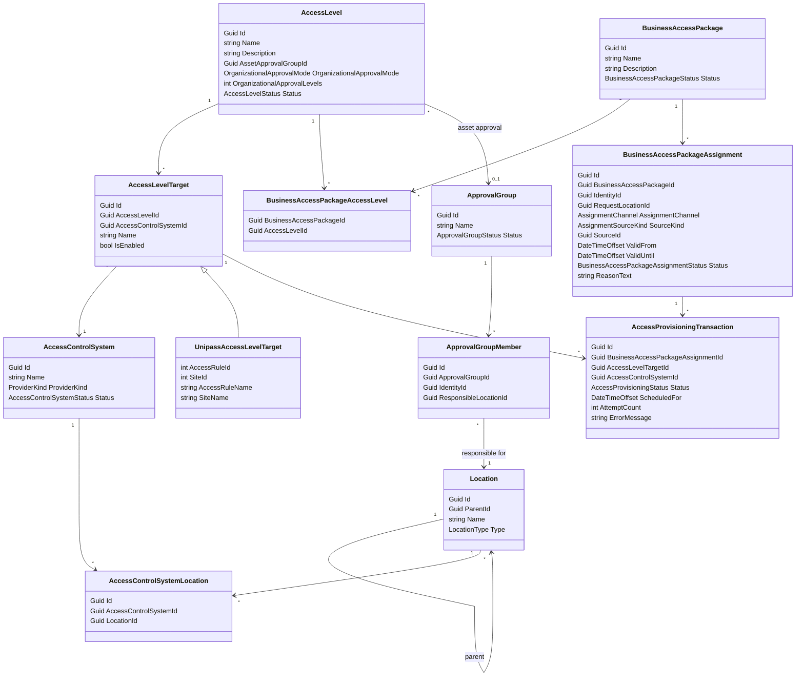
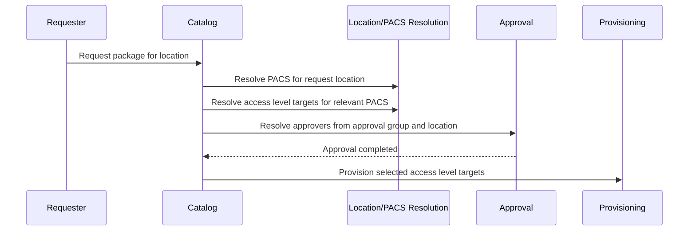
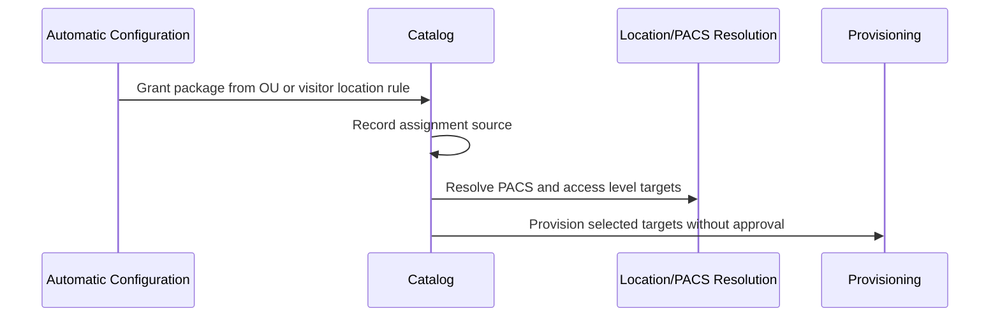

# Business Access Package Domain

Business Access Packages are requestable bundles of access. They define what access should be granted, but they do not define credentials.

Credentials are issued by onboarding or lifecycle flows, such as visitor onboarding, employee onboarding, or replacement badge flows. A package can grant access to an identity, but it should not say which QR, badge, card, or credential type the identity receives.

## Core Model

`Location` is hierarchical. A location can be a site, building, or zone. Linking a PACS to a site means it covers the child buildings and zones unless a more specific link exists.

`AccessControlSystem` is a connected PACS, for example a Unipass or Lenel system.

`AccessControlSystemLocation` links a PACS to the location scope it manages.

`AccessLevel` is a global business access concept, such as `Warehouse Access`.

`AccessLevelTarget` maps a global access level to one or more native PACS access objects. For Unipass, that target is an access rule and site.

`BusinessAccessPackage` is the catalog item that can be requested or assigned. It contains one or more global access levels.

`ApprovalGroup` is a role-like approval responsibility, such as `Facility Managers`.

`ApprovalGroupMember` scopes a member's approval authority to a location. Example: Sverre is a Facility Manager for Site Antwerp, while Kris is a Facility Manager for Site Lille.



## Example: Warehouse Access

Locations:

```text
Site Lille
- Building A
- Building B

Site Antwerp
- Building C
- Building D
```

PACS location links:

```text
PACS FR -> Site Lille
PACS BE -> Site Antwerp
```

Global access level:

```text
AccessLevel
- Name: Warehouse
- AssetApprovalGroup: Facility Managers
```

Native targets:

```text
AccessLevelTarget
- AccessLevel: Warehouse
- PACS: PACS FR
- Native target: Warehouse Lille

AccessLevelTarget
- AccessLevel: Warehouse
- PACS: PACS BE
- Native target: Warehouse Antwerp
```

Approval group membership:

```text
ApprovalGroup: Facility Managers
- Sverre, responsible for Site Antwerp
- Kris, responsible for Site Lille
```

Business package:

```text
BusinessAccessPackage: Warehouse
- AccessLevel: Warehouse
```

Request:

```text
Requester: Dimitar
Package: Warehouse
RequestLocation: Site Antwerp
```

Resolution:

```text
Site Antwerp -> PACS BE
Package Warehouse -> AccessLevel Warehouse
AccessLevel Warehouse + PACS BE -> Warehouse Antwerp target
Facility Managers + Site Antwerp -> Sverre
```

Result:

```text
Sverre approves.
After approval, PACS BE / Warehouse Antwerp is provisioned.
PACS FR / Warehouse Lille is not involved.
Kris is not asked to approve.
```

## Assignment Source

A granted package records both the assignment channel and the source.

`AssignmentChannel` determines approval behavior:

- `CatalogRequest`: requested through the access catalog and subject to approval.
- `AutomaticConfiguration`: created by trusted configuration and intentionally bypasses approval.

`SourceKind` and `SourceId` explain why the package was granted:

```text
Catalog request:
- AssignmentChannel: CatalogRequest
- SourceKind: CatalogRequest
- SourceId: RequestId
```

```text
Employee organizational unit rule:
- AssignmentChannel: AutomaticConfiguration
- SourceKind: OrganizationalUnit
- SourceId: OrganizationUnitId
```

```text
Visitor location matrix:
- AssignmentChannel: AutomaticConfiguration
- SourceKind: VisitorLocation
- SourceId: LocationId
```

Automatic configuration examples:

```text
OrganizationalUnitAccessPackageRule
- OrganizationUnitId
- BusinessAccessPackageId
- LocationId
- IsEnabled
```

```text
VisitorLocationAccessPackageRule
- LocationId
- BusinessAccessPackageId
- IsEnabled
```

## Approval Rules

Approval only applies to `CatalogRequest` assignments. Automatic configuration is trusted policy and intentionally bypasses approval.

`Asset Approval` is resolved from the access level's approval group and the request location.

```text
AccessLevel: Warehouse
ApprovalGroup: Facility Managers
RequestLocation: Site Antwerp
Approver: Facility Manager member responsible for Site Antwerp
```

`Organizational Approval` is resolved from the requester's manager chain.

```text
None: no organizational approval
L+1: direct manager approves
L+2: manager's manager approves
L+X: X levels above the employee approves
```

Catalog request flow:



Automatic configuration flow:



## Boundary Rules

- A package is a bundle of access levels, not a credential template.
- Credentials are requested by onboarding/lifecycle flows, not by access packages.
- PACS relevance is resolved from the assignment location through `AccessControlSystemLocation`.
- Linking a PACS to a site includes child buildings and zones unless a more specific rule overrides it.
- Native access ids live on `AccessLevelTarget`, not on the package or global access level.
- Provider-specific metadata lives in provider-specific target types.
- Approval group membership is location-scoped.
- Approval applies to catalog requests, not automatic configuration.
