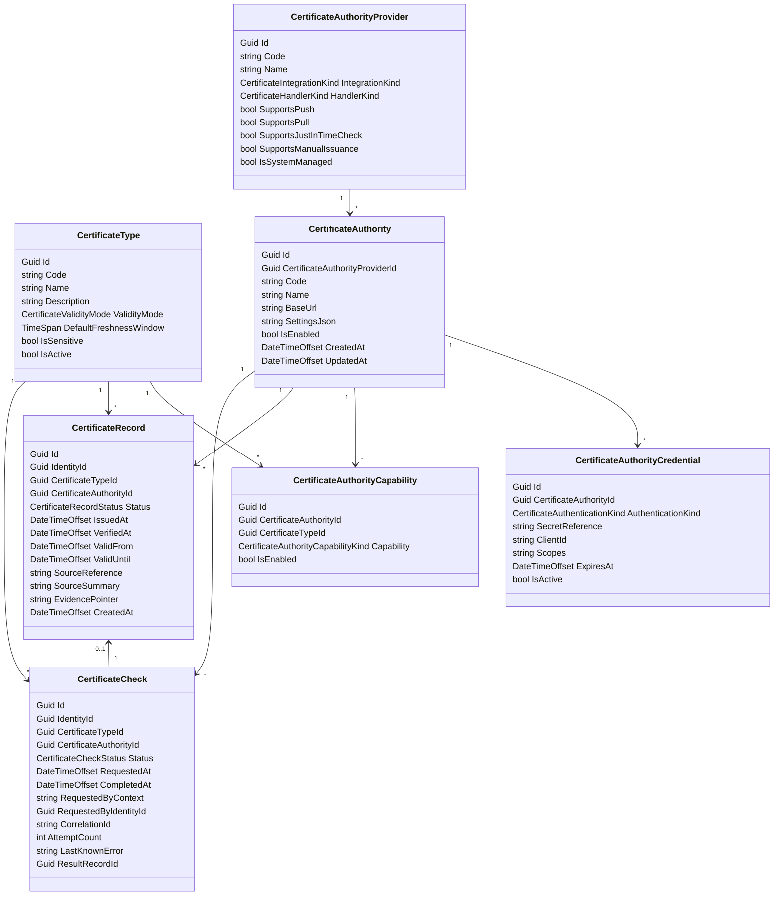

# Certificates

This document describes the `Certificates` bounded context.

`Certificates` owns certificate definitions, certificate authorities, certificate attestations, and just-in-time verification operations.

Core separation:

- `CertificateType` owns what a certificate means.
- `CertificateAuthorityProvider` owns the integration behavior supported by the platform.
- `CertificateAuthority` owns the tenant-configured authority instance, including endpoint/configuration.
- `CertificateAuthorityCredential` owns tenant-specific authentication material references for an authority.
- `CertificateAuthorityCapability` links which authority can issue or verify which certificate types.
- `CertificateRecord` stores the factual attestation for one identity from one authority.
- `CertificateCheck` stores the operational JIT verification request and outcome.

## Purpose

The `Certificates` bounded context exists to support multiple certificate acquisition models:

- stored certifications from LMS or registry imports
- manual certificates issued by operators
- just-in-time privacy-sensitive checks such as OCAD blacklist verification
- future pull-based external authorities using a constrained integration contract

The context is intentionally separate from `AccessCatalog` and `AccessControl`.

- `Certificates` owns certificate facts and verification.
- `AccessCatalog` owns certificate requirements for granting access.
- `AccessControl` owns PACS provisioning, not certification logic.

## Subject Model

Certificates are always issued against `IdentityId`.

This allows one certificate model to work for:

- employees
- visitors
- contractors

The `Certificates` context does not own workforce or visitor lifecycle. It only references `IdentityId`.

## Certificate Type

`CertificateType` represents the business meaning of a certificate.

Examples:

- `passed_course_x`
- `vca_certified`
- `not_ocad_blacklisted`

Recommended shape:

```text
CertificateType
- Id
- Code
- Name
- Description
- ValidityMode
- DefaultFreshnessWindow
- IsSensitive
- IsActive
```

Property meaning:

- `Code`: stable machine-readable key.
- `Name`: human-readable label.
- `ValidityMode`: how validity is interpreted.
- `DefaultFreshnessWindow`: default TTL for freshness-based checks such as OCAD.
- `IsSensitive`: marks privacy-sensitive certifications or checks.
- `IsActive`: administrative enablement flag.

`CertificateType` answers:

```text
What does this certification mean?
```

It does not answer who issues it or how it is checked.

## Certificate Authority Provider

`CertificateAuthorityProvider` represents a platform-supported integration behavior.

Examples:

- `ocad_blacklist`
- `vca_registry`
- `lms`
- `generic_http_pull`
- `manual`

Recommended shape:

```text
CertificateAuthorityProvider
- Id
- Code
- Name
- IntegrationKind
- HandlerKind
- SupportsPush
- SupportsPull
- SupportsJustInTimeCheck
- SupportsManualIssuance
- IsSystemManaged
```

Property meaning:

- `IntegrationKind`: broad operational mode such as manual, platform-managed, or generic pull.
- `HandlerKind`: exact code path or adapter used by the platform.
- capability flags: describe what operations this provider supports.
- `IsSystemManaged`: provider is shipped by the platform and not tenant-defined.

`CertificateAuthorityProvider` answers:

```text
What kind of authority integration does the platform know how to execute?
```

## Certificate Authority

`CertificateAuthority` represents one tenant-configured authority instance.

Examples:

- Tenant A OCAD account
- Tenant B OCAD account
- Corporate LMS for tenant X
- Internal security office manual authority
- Future configured generic pull authority

Recommended shape:

```text
CertificateAuthority
- Id
- CertificateAuthorityProviderId
- Code
- Name
- BaseUrl
- SettingsJson
- IsEnabled
- CreatedAt
- UpdatedAt
```

Property meaning:

- `CertificateAuthorityProviderId`: selects integration behavior.
- `Code`: stable tenant-level key.
- `Name`: human-readable label.
- `BaseUrl`: endpoint root when relevant.
- `SettingsJson`: provider-specific non-secret config such as route paths, tenant account ids, schema mode, timeout values.
- `IsEnabled`: authority availability switch.

`CertificateAuthority` answers:

```text
Which concrete configured authority instance does this tenant use?
```

## Certificate Authority Credential

`CertificateAuthorityCredential` stores or references tenant-specific authentication material for one authority.

Recommended shape:

```text
CertificateAuthorityCredential
- Id
- CertificateAuthorityId
- AuthenticationKind
- SecretReference
- ClientId
- Scopes
- ExpiresAt
- IsActive
```

Property meaning:

- `AuthenticationKind`: API key, OAuth client credentials, basic auth, none.
- `SecretReference`: reference to external secret storage, not raw secret value.
- `ClientId`: public credential component when applicable.
- `Scopes`: optional requested scopes.
- `ExpiresAt`: operational expiry/rotation support.
- `IsActive`: current credential selection.

V1 recommendation:

- allow exactly one active credential per authority

## Certificate Authority Capability

`CertificateAuthorityCapability` links an authority to the certificate types it can issue or verify.

Recommended shape:

```text
CertificateAuthorityCapability
- Id
- CertificateAuthorityId
- CertificateTypeId
- Capability
- IsEnabled
```

Capability examples:

- `Issue`
- `Verify`
- `Revoke`

This model allows:

- OCAD authority verifies `not_ocad_blacklisted`
- LMS authority issues `passed_course_x`
- manual internal authority issues site-specific safety certificates

## Certificate Record

`CertificateRecord` is one factual attestation for one identity, one certificate type, from one authority.

Recommended shape:

```text
CertificateRecord
- Id
- IdentityId
- CertificateTypeId
- CertificateAuthorityId
- Status
- IssuedAt
- VerifiedAt
- ValidFrom
- ValidUntil
- SourceReference
- SourceSummary
- EvidencePointer
- CreatedAt
```

Property meaning:

- `IdentityId`: subject of the certification.
- `CertificateTypeId`: meaning of the certification.
- `CertificateAuthorityId`: who issued or verified it.
- `Status`: factual outcome such as `Valid`, `Invalid`, `Expired`, or `Revoked`.
- `IssuedAt`: when source considers the attestation issued.
- `VerifiedAt`: when Fabric imported or confirmed it.
- `ValidFrom` / `ValidUntil`: validity interval if present.
- `SourceReference`: source correlation id such as course completion id or transaction id.
- `SourceSummary`: safe short explanation.
- `EvidencePointer`: pointer or hash for evidence, not raw sensitive payload by default.

Important rule:

- `CertificateRecord` stores certificate fact
- it does not store operational retry state

## Certificate Check

`CertificateCheck` is the operational JIT verification request.

Recommended shape:

```text
CertificateCheck
- Id
- IdentityId
- CertificateTypeId
- CertificateAuthorityId
- Status
- RequestedAt
- CompletedAt
- RequestedByContext
- RequestedByIdentityId
- CorrelationId
- AttemptCount
- LastKnownError
- ResultRecordId
```

Property meaning:

- `Status`: operational state such as `Pending`, `InProgress`, `Succeeded`, `FailedRetryable`, `FailedTerminal`
- `RequestedByContext`: caller such as `AccessCatalog`, `Reception`, or `Manual`
- `RequestedByIdentityId`: optional actor who triggered the check
- `CorrelationId`: distributed tracing and external support correlation
- `AttemptCount`: retry count
- `LastKnownError`: last failure reason
- `ResultRecordId`: resulting factual certificate record if check completed

Important rule:

- `CertificateCheck` stores operational work state
- `CertificateRecord` stores factual certificate outcome

Example:

```text
OCAD API reachable and person is blacklisted:
- CertificateCheck.Status = Succeeded
- CertificateRecord.Status = Invalid
```

## Validity Semantics

Recommended `CertificateValidityMode`:

- `Permanent`
- `UntilDate`
- `FreshForDuration`

Semantics:

- `Permanent`: no expiry unless explicitly revoked
- `UntilDate`: valid until source-provided end date
- `FreshForDuration`: result is valid only for a configured freshness window

Typical usage:

- LMS course pass -> `Permanent` or `UntilDate`
- VCA -> `UntilDate`
- OCAD -> `FreshForDuration`

## Authority Examples

### OCAD

```text
CertificateType
- Code: not_ocad_blacklisted
- ValidityMode: FreshForDuration
- IsSensitive: true

CertificateAuthorityProvider
- Code: ocad_blacklist
- HandlerKind: OcadBlacklist
- SupportsJustInTimeCheck: true

CertificateAuthority
- tenant-specific OCAD endpoint/account/config

CertificateAuthorityCapability
- Verify not_ocad_blacklisted
```

Behavior:

- request-time JIT check
- minimal persisted result
- short freshness window
- avoid raw blacklist payload storage unless required

### LMS

```text
CertificateAuthorityProvider
- Code: lms
- HandlerKind: Lms
- SupportsPush: true

CertificateAuthority
- tenant LMS instance

CertificateType
- passed_course_x
- passed_course_y
```

LMS course-to-certificate mapping is expected to live in saga/integration configuration, not inside the core certificate model.

### Manual Authority

```text
CertificateAuthorityProvider
- Code: manual
- SupportsManualIssuance: true

CertificateAuthority
- internal_security_office
```

Behavior:

- operator issues or revokes certificate through UI
- no external integration required

## Boundary Rules

- `Certificates` owns certificate definitions, authorities, attestations, and check operations.
- `Certificates` references subjects by `IdentityId`.
- `Certificates` does not own employee, visitor, or contractor master data.
- `Certificates` does not own access-grant policy.
- `AccessCatalog` may reference `CertificateTypeId` for access requirements.
- `Sagas` or integration modules may translate external events into certificate records.
- privacy-sensitive authorities should store minimal evidence by default.
- secrets should not be stored directly on certificate entities; use a secret reference.

## Mermaid Model



## Open Decisions

- Should one authority support multiple active credentials for rotation, or exactly one active credential in v1?
- Should authority selection be automatic by `CertificateTypeId`, or can callers require a specific `CertificateAuthorityId`?
- Should generic pull authorities be allowed in v1, or introduced only after platform-managed authorities are stable?
- Should negative results always be stored for sensitive authorities such as OCAD, or only stored for a short window?
