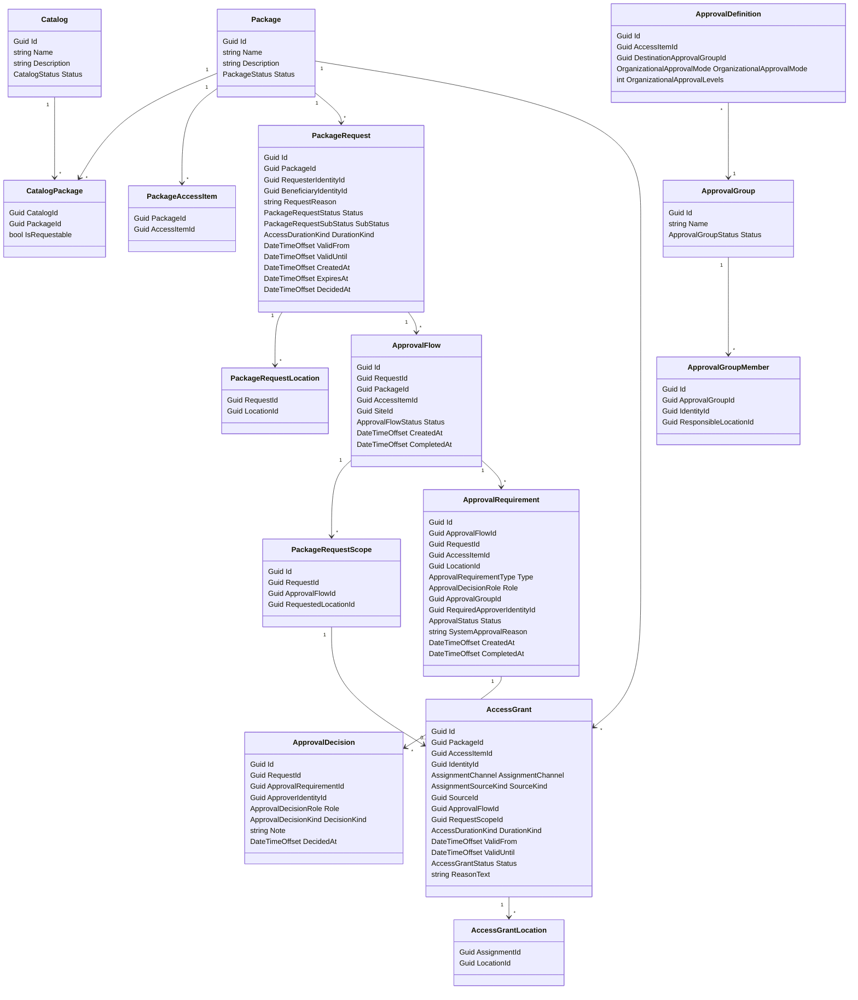

# Access Catalog

`AccessCatalog` owns catalogs, packages, package requests, access grants, approvals, and approval governance.

It owns:

- catalogs
- requestable packages
- package-to-access-item composition
- package requests
- access grants
- approval groups and scoped approval group members
- approval requirements and decisions

`Catalog` groups requestable packages. For v1, listing available requestable packages returns packages from every active catalog.

`Package` is the requestable catalog item. It contains one or more `AccessItemId` references.

`PackageRequest` is a catalog request for a package. It records the requester, beneficiary, requested descendant locations, requested duration, request reason, status, timestamps, and the final outcome.

`ApprovalFlow` is the approval unit for one access item at one normalized site. It snapshots the approval context and completes independently as `Approved`, `Rejected`, `SystemApproved`, or `Expired`.

`PackageRequestScope` is the provisioning unit for one access item at one originally requested descendant location. Multiple request scopes can point to the same approval flow when they normalize to the same site.

`AccessGrant` is a granted exact request scope for one identity. For catalog requests, Fabric creates one grant per approved request scope so PACS provisioning stays tied to the original descendant location while approval stays normalized at site level.

`AccessDurationKind` distinguishes permanent from temporary business access:

- `Permanent`: `ValidFrom` is required and `ValidUntil` is null.
- `Temporary`: both `ValidFrom` and `ValidUntil` are required and `ValidUntil` must be after `ValidFrom`.

`ApprovalGroup` is a role-like approval responsibility, such as `Facility Managers`.

`ApprovalGroupMember` scopes a member's approval authority to a site. Example: Sverre is a Facility Manager for Site Antwerp, while Kris is a Facility Manager for Site Lille.



Assignment source:

```text
Catalog request:
- AssignmentChannel: CatalogRequest
- SourceKind: CatalogRequest
- SourceId: RequestId
```

```text
Employee organizational unit rule:
- AssignmentChannel: AutomaticConfiguration
- SourceKind: OrganizationalUnit
- SourceId: OrganizationUnitId
```

```text
Visitor location matrix:
- AssignmentChannel: AutomaticConfiguration
- SourceKind: VisitorLocation
- SourceId: LocationId
```

Approval rules:

- Approval applies to `CatalogRequest`.
- Automatic configuration is trusted policy and bypasses approval.
- A request can include multiple descendant locations.
- Each requested location is normalized to its site for approval.
- Fabric creates one `ApprovalFlow` per `(RequestId, AccessItemId, SiteId)`.
- Fabric creates one `PackageRequestScope` per `(RequestId, AccessItemId, RequestedLocationId)` and links it to the normalized approval flow for that location's site.
- Destination approval resolves through `ApprovalDefinition.DestinationApprovalGroupId` and the normalized site.
- Approval group members are site-scoped only.
- If no approval group member exists for the normalized site, the destination requirement is system-approved for that site.
- System approval must record why the system approved, for example `No approver configured for request site`.
- Organizational approval resolves through the requester's manager chain.
- Organizational approver resolution is snapshotted when the request is created by storing `ApprovalRequirement.RequiredApproverIdentityId`.
- `ApprovalRequirement.Role` stores the approval role being satisfied, such as `FacilityManager`, `L+1`, or `L+2`.
- `RequiredApproverIdentityId` is used only for organizational requirements. Destination approval-group requirements keep `ApprovalGroupId` and evaluate matching scoped members at decision time.
- `L+1` is the direct manager.
- `L+2` is the manager's manager.
- A human approver may leave an optional note on approval or rejection.
- Approval decisions record the approver identity, decision timestamp, note, decision kind, and role explaining why that person could approve.
- If the same person can approve for multiple roles, one human action can satisfy those roles.
- Requests record `CreatedAt`, and completed requests record `DecidedAt`.
- When an approval flow reaches `Approved` or `SystemApproved`, Fabric can grant all linked descendant request scopes immediately.
- A partially approved request is therefore valid while other flows on the same request are still pending; the top-level request stays `InProgress` until every flow reaches a terminal state.

Multiple-approval example:

```text
Configuration:
- Destination approval group: Facility Managers
- Organizational approval: L+2

People:
- Dimitar requests access.
- Sverre is Dimitar's direct manager.
- Kris is Sverre's manager.
- Sverre is also a Facility Manager for the requested location.

Required approvals:
- L+1 manager approval: Sverre
- L+2 manager approval: Kris
- Facility Manager approval: Sverre or another matching Facility Manager

If Sverre approves as both L+1 and Facility Manager:
- ApprovalDecision: Sverre, Role L+1
- ApprovalDecision: Sverre, Role FacilityManager
- ApprovalDecision: Kris, Role L+2

If another Facility Manager approves first:
- Sverre only needs to approve Role L+1.
```

Request status:

```text
InProgress -> Completed(Approved)
InProgress -> Completed(PartiallyApproved)
InProgress -> Completed(Rejected)
InProgress -> Completed(Expired)
```

Flow status:

```text
InProgress -> Approved
InProgress -> Rejected
InProgress -> SystemApproved
InProgress -> Expired
```

`Expired` is applied to any still-pending approval flow after the configured approval window elapses.

Request summary rules:

- If any approval flow is still `InProgress`, the request is `InProgress`.
- If all flows are `Approved` or `SystemApproved`, the request completes as `Approved`.
- If some flows are approved/system-approved and some are rejected or expired, the request completes as `PartiallyApproved`.
- If no flows are approved/system-approved and one or more flows are rejected, the request completes as `Rejected`.
- If no flows are approved/system-approved and pending flows time out, the request completes as `Expired`.

Catalog listing rule:

- For v1, available requestable packages are listed from all active catalogs.
- A package is requestable when it is linked to an active catalog through `CatalogPackage.IsRequestable`.
- Catalog scoping, audience targeting, and requester eligibility can be added later.

Access Catalog references `AccessItemId` from Access Control and `LocationId` from Locations by id. It should not own native PACS mapping or technical PACS assignments.
