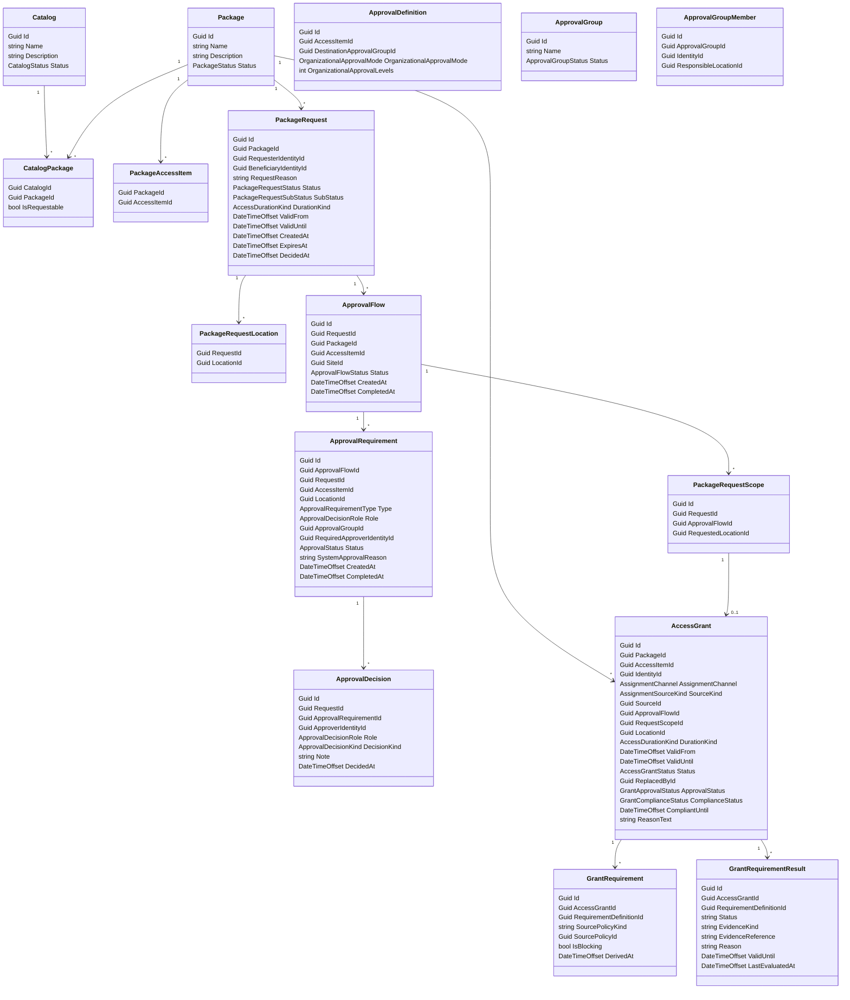

# Access Catalog

`AccessCatalog` owns catalogs, packages, package requests, access grants, approvals, grant-attached requirements, grant compliance state, and the derived grant provisioning status exposed to read models.

It owns:

- catalogs
- requestable packages
- package-to-access-item composition
- package requests
- access grants
- approval groups and scoped approval group members
- approval requirements and decisions
- grant-attached requirements derived at grant creation time
- grant compliance status consumed by provisioning
- derived grant provisioning status for read models and UI

`AccessCatalog` does not own requirement policy or evidence. It consumes those from `Requirements` when grants are created or reevaluated.

## Core Concepts

`Catalog` groups requestable packages. For v1, listing available requestable packages returns packages from every active catalog.

`Package` is the requestable catalog item. It contains one or more `AccessItemId` references.

`PackageRequest` is a catalog request for a package. It records the requester, beneficiary, requested descendant locations, requested duration, request reason, status, timestamps, and final outcome.

`ApprovalFlow` is the approval unit for one access item at one normalized site. It snapshots the approval context and completes independently as `Approved`, `Rejected`, `SystemApproved`, or `Expired`.

`PackageRequestScope` is the request scope for one access item at one originally requested descendant location. Multiple request scopes can point to the same approval flow when they normalize to the same site.

`AccessGrant` is the business grant unit for one identity, one access item, and one grant location context.

Grant grain rules:

- one `AccessGrant` per `AccessItem`
- one `AccessGrant` per grant location context
- packages are composition and request input only, not grant granularity

Important distinction:

- approval answers whether the grant is authorized
- compliance answers whether requirements are currently satisfied
- provisioning answers whether technical access should exist in PACS right now

`AccessGrant` persists compliance truth, while provisioning status is a derived projection for UI and read models.

`AccessDurationKind` distinguishes permanent from temporary business access:

- `Permanent`: `ValidFrom` is required and `ValidUntil` is null.
- `Temporary`: both `ValidFrom` and `ValidUntil` are required and `ValidUntil` must be after `ValidFrom`.

`ApprovalGroup` is a role-like approval responsibility, such as `Facility Managers`.

`ApprovalGroupMember` scopes a member's approval authority to a site. Example: Sverre is a Facility Manager for Site Antwerp, while Kris is a Facility Manager for Site Lille.

## Access Grant Model

`AccessGrant` owns the business lifecycle of a grant, including approval and compliance gates.

Recommended shape:

```text
AccessGrant
- Id
- PackageId
- AccessItemId
- IdentityId
- AssignmentChannel
- SourceKind
- SourceId
- ApprovalFlowId?
- RequestScopeId?
- LocationId
- DurationKind
- ValidFrom
- ValidUntil
- Status
- ReplacedById?
- ApprovalStatus
- ComplianceStatus
- CompliantUntil
- ReasonText
```

Recommended lifecycle rules:

- package/access basis is immutable in place
- grant location is immutable in place
- validity window may be updated in place
- a replaced grant points to `ReplacedById`
- the grant domain supports replacement but does not decide when replacement is required
- sagas/process managers decide whether a source change should update validity or replace the grant

Recommended enums:

```text
AccessGrantStatus
- Planned
- Active
- Revoked
- Replaced
- Expired

GrantApprovalStatus
- NotRequired
- Pending
- Approved
- Rejected

GrantComplianceStatus
- Compliant
- TemporarilyCompliant
- NonCompliant

GrantProvisioningStatus
- NonProvisionable
- Provisioning
- Provisioned
```

## Grant Requirement Attachment

When a grant is created, `AccessCatalog` asks `Requirements` to derive the effective requirement set for that grant context.

Recommended shape:

```text
GrantRequirement
- Id
- AccessGrantId
- RequirementDefinitionId
- SourcePolicyKind
- SourcePolicyId
- IsBlocking
- DerivedAt
```

Important rules:

- requirement derivation happens once at grant creation time
- grants do not automatically pick up later policy changes
- if a package or location context changes, the old grant should be replaced rather than relocated or reassigned
- an explicit admin operation may later recalculate future grants after policy changes

If no `GrantRequirement` rows are attached:

- `ComplianceStatus = Compliant`
- `CompliantUntil = null`

## Grant Compliance Evaluation

`Requirements` evaluators recalculate compliance for the grant's attached requirements.

Recommended per-requirement result shape:

```text
GrantRequirementResult
- Id
- AccessGrantId
- RequirementDefinitionId
- Status
- EvidenceKind
- EvidenceReference
- Reason
- ValidUntil
- LastEvaluatedAt
```

Grant summary rules:

```text
Compliant
- every attached blocking requirement is satisfied
- and no satisfied requirement expires before grant end

TemporarilyCompliant
- every attached blocking requirement is satisfied now
- but at least one satisfied requirement expires before grant end

NonCompliant
- one or more attached blocking requirements are currently unsatisfied
```

`CompliantUntil` rules:

- `null` for fully compliant grants
- earliest satisfied requirement expiry for temporarily compliant grants
- ignored for non-compliant grants

Permanent grants may still be `TemporarilyCompliant`.

## Provisioning Rule

Provisioning is allowed only when approval, validity, and access-item compliance policy allow it.

```text
Provisionable(now) =
  grant is active for now
  and ApprovalStatus in {Approved, NotRequired}
  and (
    AccessItem.IsComplianceRequired = false
    or ComplianceStatus in {Compliant, TemporarilyCompliant}
  )
```

Provisioning end:

```text
Compliant -> grant.ValidUntil
TemporarilyCompliant -> min(grant.ValidUntil, grant.CompliantUntil)
NonCompliant + IsComplianceRequired=true -> no provisioning
NonCompliant + IsComplianceRequired=false -> grant.ValidUntil
```

If `grant.ValidUntil` is null on a permanent grant:

- `Compliant` means open-ended from the grant side
- `TemporarilyCompliant` means provisioning ends at `CompliantUntil`

Derived provisioning projection:

```text
NonProvisionable
- approval/validity/compliance-required gate fails

Provisioning
- business gate passes
- desired PACS state does not yet match actual state

Provisioned
- business gate passes
- desired PACS state matches actual state
```

## Approval Rules

- Approval applies to `CatalogRequest` grants.
- Automatic configuration is trusted policy and uses `ApprovalStatus = NotRequired`.
- A request can include multiple descendant locations.
- Each requested location is normalized to its site for approval.
- Fabric creates one `ApprovalFlow` per `(RequestId, AccessItemId, SiteId)`.
- Fabric creates one `PackageRequestScope` per `(RequestId, AccessItemId, RequestedLocationId)` and links it to the normalized approval flow for that location's site.
- Destination approval resolves through `ApprovalDefinition.DestinationApprovalGroupId` and the normalized site.
- Approval group members are site-scoped only.
- If no approval group member exists for the normalized site, the destination requirement is system-approved for that site.
- Organizational approval resolves through the requester's manager chain.
- When an approval flow reaches `Approved` or `SystemApproved`, Fabric creates the corresponding grant.
- Compliance preview for package requests is location-scoped because requirement context depends on the requested location, not on the access item.
- Each access item separately declares whether that shared compliance result blocks provisioning through `AccessItem.IsComplianceRequired`.
- An approved grant may therefore be `NonCompliant` while still progressing toward provisioning when its access item does not require compliance.

## Automatic Grants

Automatic grants are created by automation/saga contexts.

Examples:

```text
Employee organizational unit rule:
- AssignmentChannel: AutomaticConfiguration
- SourceKind: OrganizationalUnit
- SourceId: OrganizationUnitId
```

```text
Visitor or contractor reception-driven rule:
- AssignmentChannel: AutomaticConfiguration
- SourceKind: ReceptionArrival or other workflow source
- SourceId: source aggregate id
```

Important rules:

- automatic grants bypass approval
- automatic grants still derive attached requirements at creation time
- automatic grants may be created even when initially non-compliant
- provisioning is withheld until they become compliant only when the access item requires compliance
- sagas decide whether later source changes update validity or replace the grant

## Replacement And Validity Updates

The grant domain allows two distinct operations:

- update validity window
- replace a grant with a successor grant

Grant domain invariants:

- location cannot be changed in place
- package/access basis cannot be changed in place
- validity dates may be changed in place

Saga/process manager responsibility:

- decide whether a source change should update validity or replace the grant
- decide when an old automatic grant should be revoked or marked replaced
- create the replacement grant when needed

Examples:

```text
Allowed in place:
- visit end time moved from 16:00 to 18:00
- assignment start date moved by one day
```

```text
Requires replacement:
- grant location changed from Building A to Building B
- workflow now needs a different package
```

## Compliance Recalculation Triggers

Grant requirements are not re-derived automatically, but grant compliance is recalculated when:

- evidence is added, removed, revoked, rejected, or expired for a requirement attached to the grant
- external check result changes for a requirement attached to the grant
- escort presence changes for a requirement attached to the grant
- the automated grant validity window changes and a requirement evaluator depends on grant timing

Policy changes do not automatically trigger re-derivation.

## Manual Grant Requirement Recalculation

`AccessCatalog` should expose an explicit administrative operation for policy-change follow-up.

Recommended shape:

```text
RecalculateGrantRequirements
- FutureOnly: bool
```

Recommended behavior:

- `FutureOnly = true`: rebuild attached requirement sets only for future grants
- `FutureOnly = false`: rebuild attached requirement sets for all non-terminal grants chosen by the operation scope

This is the only normal path for existing grants to pick up new requirement policy.

## Mermaid Model



## Example: Employee Request

```text
Employee requests Warehouse package for Site Antwerp.
Approval flow completes Approved.
Grant is created.
ApprovalStatus = Approved.

Attached grant requirements:
- site_safety_training
- badge_photo_uploaded
```

If badge photo is still missing:

```text
ComplianceStatus = NonCompliant
GrantProvisioningStatus = NonProvisionable
```

If badge photo arrives later:

```text
ComplianceStatus recalculates to Compliant or TemporarilyCompliant
GrantProvisioningStatus moves to Provisioning or Provisioned depending on PACS convergence
```

## Example: Contractor Automatic Grant

```text
Contractor job creates automatic grant Mon-Fri for Site Antwerp.
ApprovalStatus = NotRequired.
Grant requirements are attached at creation.

Initial state may be:
- ComplianceStatus = NonCompliant
- GrantProvisioningStatus = NonProvisionable when the access item requires compliance
```

When evidence later satisfies all attached requirements until Thursday:

```text
ComplianceStatus = TemporarilyCompliant
CompliantUntil = Thursday 18:00
GrantProvisioningStatus = Provisioning or Provisioned until Thursday 18:00
```

## Boundary Rules

- `AccessCatalog` owns packages, requests, grants, approvals, grant-attached requirements, and grant compliance status.
- `AccessCatalog` consumes `RequirementDefinitionId` and evaluation outcomes from `Requirements`.
- `AccessCatalog` does not own requirement policy or evidence.
- `AccessCatalog` does not own native PACS mappings or technical assignments.
- `AccessControl` consumes provisionable grants and creates or revokes PACS assignments.
