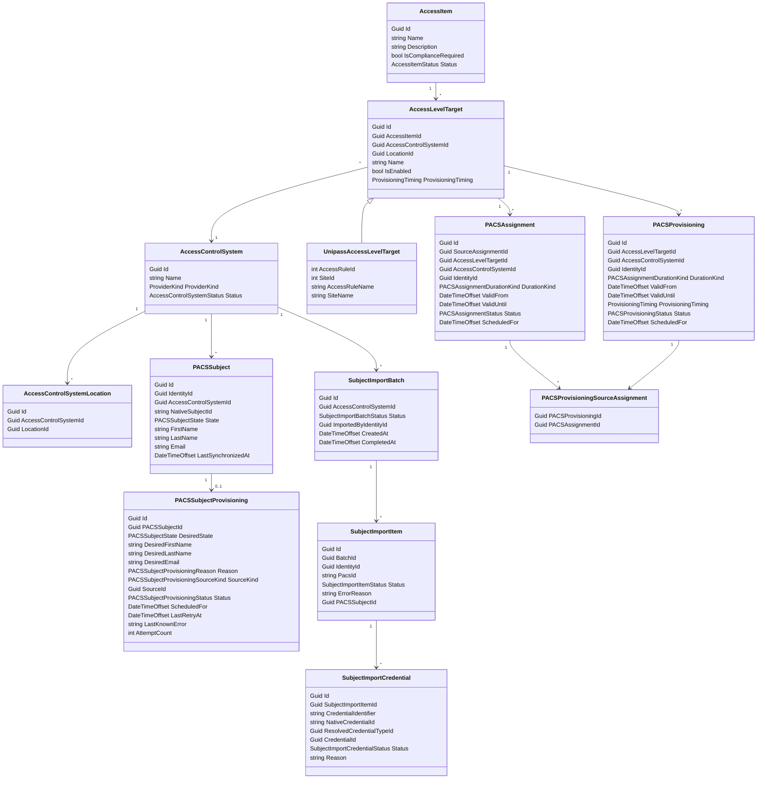

# Access Control

`AccessControl` owns the technical access-control catalog and PACS-native mappings.

`AccessControlSystem` represents a connected PACS, such as Unipass Belgium or Unipass France.

`AccessControlSystemLocation` links a PACS to the location scope it manages. It can point anywhere in the location tree.

Resolution rules:

- One location can be linked to zero or one PACS.
- One PACS can be linked to multiple locations.
- If a PACS is linked to a site, it covers child buildings and zones unless a child location has its own PACS link.
- Resolving PACS for a request location walks up the location tree and uses the nearest PACS link.
- If no PACS link is found for the request location or its ancestors, no PACS target can be selected.

`AccessItem` is a global business access concept, such as `Warehouse Access`.

`AccessItem.IsComplianceRequired` is a business-level provisioning gate:

- `true`: grant compliance blocks provisioning for that access item.
- `false`: grant compliance is still evaluated and shown, but non-compliance does not block provisioning for that access item.

`AccessLevelTarget` maps an access item to one or more native PACS access objects. For Unipass, a target maps to an access rule and site. It also defines technical provisioning timing such as eager provisioning or provisioning at valid-from.

`AccessLevelTarget.LocationId` is optional target-selection scope inside a PACS:

- `LocationId = null`: target is global within that PACS for the access item.
- `LocationId = X`: target applies only when the grant location is inside X's location tree.

`PACSAssignment` is the source technical assignment input for one `AccessGrant` reason. Multiple `PACSAssignment` rows can point to the same native PACS target for the same identity.

`PACSProvisioning` is the effective technical PACS row that should exist in the provider after reconciling all active `PACSAssignment` inputs for an identity and native target.

`PACSProvisioningSourceAssignment` links one effective `PACSProvisioning` row back to the contributing source `PACSAssignment` rows for full traceability.

`PACSSubject` is Fabric's minimal cardholder/person concept for one identity in one access-control system. It stores the last successfully synchronized representation that Fabric knows exists in that PACS.

`PACSSubjectProvisioning` is the latest desired update operation for a `PACSSubject`. It is operational state, not history. On successful provisioning, Fabric updates `PACSSubject` and deletes the provisioning row. If provisioning fails, Fabric keeps the provisioning row for retry and `PACSSubject` continues to reflect the last successfully synchronized representation.



Boundary rules:

- Access Control references locations by `LocationId`.
- Native PACS ids live on `AccessLevelTarget`, not on packages or access items.
- Provider-specific metadata lives in provider-specific target types.
- Access Control owns source PACS assignment inputs, effective PACS provisioning rows, and the reconciliation between them.
- Access Control owns PACS subject/cardholder projections and provisioning operations.
- Access Control owns PACS subject import batches and reports.
- Access Control does not own request approval or package request workflow.

Target resolution rules:

- PACS routing and target selection are separate steps.
- Step 1: resolve the nearest linked PACS from the grant location.
- Step 2: inside that PACS, resolve the best matching enabled `AccessLevelTarget` scope for the access item:
  - exact room
  - then building
  - then site
  - then global target where `LocationId = null`
- If multiple targets exist at the winning scope, all of them apply.
- A less specific scope must not be combined with a more specific winning scope for the same provisioning decision.

This separation matters for customers with one PACS that covers many sites or buildings. PACS links answer which PACS handles a location. Scoped access-level targets answer which native rule inside that PACS should be used.

Effective provisioning rules:

- `PACSAssignment` is a source row, not the final provider row.
- Effective provider state is represented by `PACSProvisioning`.
- `PACSProvisioning` is current expected PACS state, not a historical ledger. If no provider row should exist, no `PACSProvisioning` row should exist.
- Reconciliation groups source assignments by `IdentityId`, `AccessControlSystemId`, and native target (`AccessLevelTargetId`).
- If any grouped source assignment is permanent, the effective provisioning row is permanent.
- Temporary source assignments merge when their windows overlap or are adjacent.
- Disjoint temporary windows become multiple effective `PACSProvisioning` rows.
- `PACSProvisioningSourceAssignment` preserves traceability from an effective provider row back to the contributing source assignments.
- `PACSProvisioning` lifecycle is:
  - `Pending`: Fabric wants the native PACS row created. It is not yet expected to exist in PACS.
  - `Provisioned`: Fabric expects the native PACS row to exist.
  - `PendingRevocation`: Fabric wants the native PACS row removed, but still expects it to remain in PACS until delete succeeds.
- Provisioning failures are retry metadata on the current row, not separate terminal status values. Failed create keeps the row `Pending`. Failed revoke keeps the row `PendingRevocation`.
- When PACS delete succeeds, the `PACSProvisioning` row and its source links are removed.
- For Unipass permanent provisioning, no start time or end time is written. Temporary provisioning writes start and end times.
- Provisioning eligibility comes from `AccessCatalog` per grant. Compliance truth remains location-context-driven, but `AccessItem.IsComplianceRequired` decides whether a non-compliant grant is blocked or still allowed to provision.

Conformity audit rules:

- Audit compares actual PACS state against current `PACSProvisioning` rows for the subject and PACS.
- Expected access for audit includes `PACSProvisioning` rows in `Provisioned` and `PendingRevocation`.
- Expected access excludes `Pending` because those rows are not yet expected in PACS.
- Audit compares all current native access rows returned by Unipass. It does not filter to only currently active windows.
- Native access comparison uses provider-shape keys: site, rule, start, and end.
- Comparison uses counts, not only set membership, so duplicate native rows are anomalies.

## Existing PACS Subject And Credential Onboarding

Most PACS systems are not empty when Fabric is introduced. For existing production PACS systems, Fabric should not guess cardholder links or create duplicate cardholders by default.

Safe onboarding procedure:

```text
1. Link HR/classifier to Fabric.
   Acceptance:
   - Employees exist in Fabric.
   - Employees have correct IdentityId.
   - Employees have correct personas.
   - Employees have correct OUs.
   - Employees have correct work locations.

2. Export cardholders from PACS.
   Include:
   - PACS primary id
   - display name or other human-readable matching fields

3. Export employees from Fabric.
   Include:
   - IdentityId
   - employee name
   - email
   - employee number
   - directory id
   - personas
   - OU
   - work locations

4. Create link CSV.
   Mandatory fields:
   - IdentityId
   - PacsId
   Optional credential fields:
   - CredentialIdentifier
   - NativeCredentialId

5. Configure/link PACS in Fabric.
   - Create AccessControlSystem.
   - Link PACS to locations.

6. Import CSV for that PACS.
   Fabric creates a SubjectImportBatch report.

7. Configure and enable package/access automation only after import succeeds.
```

`SubjectImportBatch` is the Access Control import root:

```text
SubjectImportBatch
- AccessControlSystemId
- Status
- ImportedByIdentityId
- CreatedAt
- CompletedAt
```

Each row creates a subject import item:

```text
SubjectImportItem
- IdentityId
- PacsId
- Status // Mapped, Error, Filtered
- ErrorReason?
- PACSSubjectId?
```

Each subject row can contain imported credentials:

```text
SubjectImportCredential
- CredentialIdentifier
- NativeCredentialId?
- ResolvedCredentialTypeId?
- CredentialId?
- Status // Imported, Unmapped, Conflict, Error
- Reason?
```

Successful subject rows create or link:

```text
PACSSubject
   - IdentityId
   - AccessControlSystemId
   - NativeSubjectId = PacsId
   - LinkSource = ManualImport
```

`PACSSubject` is Fabric's normalized subject model, not a byte-for-byte mirror of each PACS provider schema. It may contain fields such as `Email` even if a specific PACS cannot store or return that field.

Provider synchronization rules:

- `PACSSubject` is updated only after a successful provider sync or import.
- If a provider does not support one of Fabric's normalized subject fields, Fabric still keeps that field on `PACSSubject` and the provider adapter ignores it during sync.
- `PACSSubjectProvisioning` stores only the latest desired update per `PACSSubject`.
- Last writer wins: if a new desired update arrives while an older provisioning row is pending or failed, Fabric overwrites the existing provisioning row with the latest desired values.
- A failed `PACSSubjectProvisioning` means `PACSSubject` still reflects the last known successful PACS representation.
- Successful provisioning deletes the `PACSSubjectProvisioning` row.

Subject import validation:

- `IdentityId` exists.
- `PacsId` is present.
- `PacsId` is unique within the PACS.
- `IdentityId` is not already linked to another `PACSSubject` in the same PACS.
- `PacsId` is not already linked to another `IdentityId`.

Repeat imports:

- If the same `IdentityId` and `PacsId` mapping already exists, the row is `Filtered`.
- `Filtered` means no new mapping was created because the mapping already exists from a previous import or auto-create.
- If either side is linked to a different value, the row is `Error`, not `Filtered`.

Credential import behavior:

```text
For each successful SubjectImportItem:
- import credentials for that subject
- resolve candidate CredentialTypes through CredentialTypeTarget for the PACS
- if multiple CredentialTypes map to the same CredentialTypeTarget, reduce by CredentialRange when possible
- create managed Fabric Credential for mapped credentials
- create CredentialPACSAssignment or native credential link
- record unmapped, ambiguous, or conflicted credentials as SubjectImportCredential rows
```

Credential validation:

- `CredentialIdentifier` is present.
- `CredentialIdentifier` is tenant-globally unique.
- Candidate credential types are found from `CredentialTypeTarget` records that target the imported PACS.
- For range-allocated credential types, `CredentialIdentifier` parses as numeric and falls inside an active `CredentialRange`.
- If exactly one candidate credential type remains after target and range resolution, a managed Fabric credential can be created.
- If no candidate remains, the row is `Unmapped`.
- If multiple candidates remain, the row is `Ambiguous`.
- `NativeCredentialId` is not already linked, if provided.

Unmapped credentials:

```text
SubjectImportCredential
- Status: Unmapped
- Reason: OutsideCredentialTypeRanges
```

Ambiguous credentials:

```text
SubjectImportCredential
- Status: Ambiguous
- Reason: MultipleCredentialTypesMatched
```

Ambiguous rows are not imported as managed credentials automatically. Later, an operator can clarify the row from the import report by selecting the intended `CredentialType`. After clarification, Credential Management creates the managed credential if the identifier is still valid and unique.

A subject can be `Mapped` while one or more credentials are `Unmapped`. A subject with invalid `IdentityId` or `PacsId` is `Error`, and its credentials must not create managed Fabric credentials.

Credential ownership split:

- Access Control owns the import batch/report.
- Credential Management owns successful managed `Credential` records.
- Credential Management advances allocation state per range-allocated `CredentialType` to the highest successfully imported numeric identifier for that type.

Example report:

```text
SubjectImportBatch: PACS BE, CompletedWithErrors

SubjectImportItem: Identity Dimitar, PacsId 10001, Mapped
- SubjectImportCredential: 123456, CredentialType Employee Desfire, Imported
- SubjectImportCredential: 999999, Unmapped, OutsideCredentialTypeRanges
- SubjectImportCredential: 120000, Ambiguous, MultipleCredentialTypesMatched

SubjectImportItem: Identity Alice, PacsId 10002, Error
- ErrorReason: InvalidIdentityId

SubjectImportItem: Identity Sverre, PacsId 10003, Mapped
- SubjectImportCredential: 123900, CredentialType Employee Desfire, Imported

SubjectImportItem: Identity Kris, PacsId 10004, Filtered
- Reason: MappingAlreadyExists
```

After this import, PIAM can show imported PACS credentials as managed Fabric credentials for mapped employees, while unmapped credentials remain visible in the import report for follow-up.
