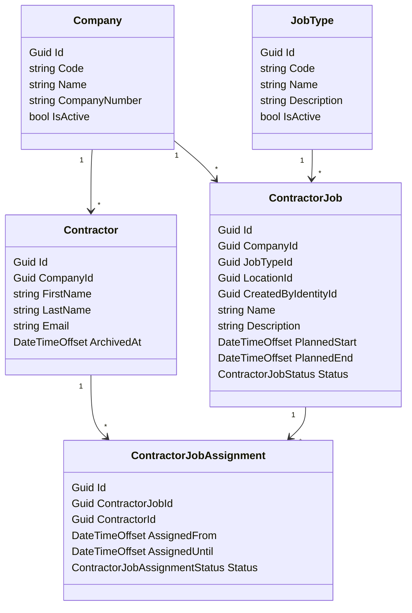

# Contractors

This document describes the `Contractors` bounded context.

`Contractors` owns contractor companies, contractors, contractor job types, contractor jobs, and contractor job assignments.

## Core Separation

- `Contractors` owns who the contractor is, which company they work for, and which jobs they are assigned to.
- `Locations` owns the physical location hierarchy.
- `Identities` owns canonical identity records and contractor-to-identity affiliation.
- `Requirements` owns requirement definitions, location-scoped requirement policy, location job requirement policy, evaluator behavior, and evidence.
- `AccessCatalog` owns grants, grant-attached requirements, and grant compliance state.
- `Reception` owns expected arrivals and expected offboard windows.
- automation/application services coordinate contractor side effects into `Reception`, `Requirements`, `AccessCatalog`, and other contexts.

## Purpose

The `Contractors` bounded context exists to answer:

```text
Which contractors from which company are assigned to which work at which location and during which time window?
```

The context must support:

- persistent contractors
- contractor linked to exactly one current company
- jobs owned by a company
- one job has exactly one job type
- jobs planned for a location
- many contractors assigned to one job
- one contractor assigned to many jobs
- assignment windows that cannot outlive the job window

## Operational Roles

`Contractors` has two operational roles over the same bounded context.

### Contractor Enrollment

Role: `contractor-enrollment`

Purpose: manage contractor master data.

Can:

- create jobs they own
- edit jobs they own
- create job assignments on jobs they own
- edit job assignments on jobs they own
- create companies
- edit companies
- create contractors
- edit contractors

Can also:

- read companies and contractors for context
- read jobs and assignments they own

Cannot:

- manage jobs owned by another actor
- manage assignments owned by another actor

### Contractor Planning

Role: `contractor-planning`

Purpose: manage contractor work planning.

Can:

- create jobs
- edit jobs they own
- create job assignments on jobs they own
- edit job assignments on jobs they own
- list contractors for assignment selection
- view contractor details needed for assignment planning
- view companies needed for planning context

Cannot:

- create companies
- edit companies
- create contractors
- edit contractors

This split keeps contractor and company master data separate from work planning responsibility.

## Core Domain Rules

- `Contractor` is persistent, not recreated per visit.
- `Contractor` belongs to one current `Company`.
- `Company` can have many contractors.
- `Company` can have many jobs.
- one `ContractorJob` has exactly one `JobType`.
- one `ContractorJob` points to one `LocationId`.
- one `ContractorJobAssignment` links one contractor to one job for one actual assignment window.
- `ContractorJobAssignment.AssignedUntil` must not be after `ContractorJob.PlannedEnd`.
- a contractor assigned to a job must belong to the same company as the job.
- one contractor can have multiple active assignments at the same time.
- active contractor assignments and job types can be consumed by downstream contexts when deriving contractor grants and requirements.

## Company

`Company` is the contractor employer or legal external organization.

Recommended shape:

```text
Company
- Id
- Code
- Name
- CompanyNumber
- IsActive
```

`Company` answers:

```text
Which external organization employs or represents this contractor?
```

## Contractor

`Contractor` is the persistent external worker record.

Recommended shape:

```text
Contractor
- Id
- CompanyId
- FirstName
- LastName
- Email
- ArchivedAt
```

`Contractor` answers:

```text
Which external person is this, and which company do they currently belong to?
```

Important rule:

- `Contractor` is not time-boxed by one visit or one job

## Job Type

`JobType` is the work classification used by contractor planning and contractor-specific requirement derivation.

Examples:

- `Welding`
- `Electrical`
- `Scaffolding`
- `Maintenance`

Recommended shape:

```text
JobType
- Id
- Code
- Name
- Description
- IsActive
```

`JobType` answers:

```text
What kind of work is being performed?
```

## Contractor Job

`ContractorJob` is a company-owned work item planned for one location and one job type.

Recommended shape:

```text
ContractorJob
- Id
- CompanyId
- JobTypeId
- LocationId
- CreatedByIdentityId
- Name
- Description
- PlannedStart
- PlannedEnd
- Status
```

Status examples:

- `Planned`
- `Active`
- `Completed`
- `Cancelled`

Important rules:

- one job has exactly one `JobType`
- one job points to one `LocationId`
- `CreatedByIdentityId` records planning ownership

`ContractorJob` answers:

```text
What work is this company doing, where, and during which planned window?
```

## Contractor Job Assignment

`ContractorJobAssignment` links a contractor to a job for the actual assignment window.

Recommended shape:

```text
ContractorJobAssignment
- Id
- ContractorJobId
- ContractorId
- AssignedFrom
- AssignedUntil
- Status
```

Status examples:

- `Planned`
- `Active`
- `Completed`
- `Cancelled`

Important rules:

- `AssignedUntil <= ContractorJob.PlannedEnd`
- assignment window is the person-specific assignment window for that job
- different contractors on the same job can have different assignment windows

`ContractorJobAssignment` answers:

```text
Is this contractor assigned to this job right now, and until when?
```

## Identity Linkage Boundary

`Contractors` is not the source of truth for canonical identity linkage.

V1 rule:

- contractor-to-identity linkage stays in `Identities.ContractorAffiliation`
- `Contractors` may request the link to be created
- `Contractors` should not add its own persistent `IdentityId` source of truth

Why this matters:

- avoids duplicate ownership for canonical person linkage
- keeps identity lifecycle concerns centralized in `Identities`
- gives `Requirements`, `Reception`, and other contexts one stable identity link path to consume

## Aggregate Boundary

V1 uses `ContractorJob` as the aggregate root for assignments.

Why:

- the strongest local invariant is `AssignedUntil <= PlannedEnd`
- modeling `ContractorJobAssignment` as a child entity keeps that rule inside one aggregate
- this avoids cross-aggregate coordination for the most common write path

This is a deliberate simplicity choice for v1, not a statement that assignments can never be promoted later.

## Lifecycle Semantics

V1 lifecycle behavior:

- `Company` can be activated or deactivated.
- `JobType` can be activated or deactivated.
- `Contractor` can be archived or unarchived.
- `ContractorJob` can move through `Planned`, `Active`, `Completed`, `Cancelled`.
- `ContractorJobAssignment` can move through `Planned`, `Active`, `Completed`, `Cancelled`.

When a job is completed or cancelled, open assignments are forced to the same terminal state.

## Planning Ownership

Planning ownership is defined at the job level.

Rules:

- `ContractorJob.CreatedByIdentityId` is set when the job is created
- a planner sees only jobs where `CreatedByIdentityId == current actor identity`
- a planner can edit only jobs they own
- a planner can create, edit, list, and cancel assignments only for jobs they own
- assignment ownership is not tracked separately; it follows the parent job

This matches the current aggregate boundary where `ContractorJob` owns its assignments.

## Location-Based Planning And Requirements Integration

`Contractors` stays location-based.

Rules:

- `ContractorJob` references `LocationId`
- `Contractors` does not resolve ancestor paths or requirement policy itself
- `Requirements` consumes contractor planning facts when deriving contractor grant requirements
- contractor grants use location requirement policy plus matching location job requirement policy for active `JobTypeId` values relevant to the grant context

For contractor grant derivation:

```text
1. Resolve active ContractorJobAssignment rows for contractor.
2. Join to ContractorJob rows.
3. Filter to jobs relevant to the grant location context.
4. Collect active JobTypeId values.
5. Resolve location-based requirement policy from the target LocationId and its ancestors.
6. Resolve matching location job requirement policy for the active JobTypeId set.
7. AccessCatalog attaches the derived requirement set to the grant.
```

This keeps responsibilities clean:

- `Locations` owns physical structure
- `Contractors` owns work planning facts
- `Requirements` owns derivation policy and evaluation behavior
- `AccessCatalog` owns the attached grant requirement set and resulting compliance state

This also means:

- employees can stay location-based
- visitors can stay location-based
- contractor jobs can stay location-based
- requirement policy does not have to leak into every other domain model

## Multiple Active Jobs

One contractor can have multiple active assignments at the same time.

If multiple active assignments are relevant to the same grant context:

- collect all active `JobTypeId` values relevant to that context
- derive contractor-specific requirements from the union of matching location job requirement policies
- attach the resulting requirement set to the grant in `AccessCatalog`

Example:

```text
Contractor A
- Assignment 1: Welding at Antwerp Building A
- Assignment 2: Electrical at Antwerp Building B

If both assignments are relevant to the same contractor grant context:
-> effective contractor job types = Welding + Electrical
-> derived requirements = location requirements + welding requirements + electrical requirements
```

If assignments are relevant to different grant contexts on the same day:

- derive requirements separately per grant context
- each grant keeps its own attached requirement set and compliance state

## Reception Integration

`Reception` is the operational expected-arrival context, not the owner of contractor jobs.

Recommended flow:

```text
Contractors
-> contractor lifecycle automation/application service
-> Reception expected arrival / expected offboard window
```

Meaning:

- contractor jobs and assignments are source business facts
- `Reception` keeps the operational arrival-side view needed for check-in and expected timing windows
- changes in contractor planning can project into `Reception` through explicit automation or application-service coordination

## Boundary Rules

- `Contractors` owns company, contractor, job type, job, and assignment data.
- `Contractors` references `LocationId`.
- `Contractors` does not own canonical identity linkage.
- `Contractors` does not own requirement policy, evidence, or evaluator behavior.
- `Contractors` does not own grants or grant compliance state.
- `Contractors` does not own expected-arrival operational records in `Reception`.
- `Requirements` may read contractor job and assignment facts to determine active job types for derivation.
- `AccessCatalog` may consume contractor-derived requirement sets and compliance results when managing grants.

## Authorization Guidance

Recommended endpoint split:

- company create/update/activate/deactivate -> requires `contractor-enrollment`
- company list/detail -> requires `contractor-planning` or `contractor-enrollment`
- contractor create/update/archive/unarchive -> requires `contractor-enrollment`
- contractor list/detail for planning selection -> requires `contractor-planning` or `contractor-enrollment`
- job CRUD -> requires `contractor-planning` or `contractor-enrollment`
- job-assignment CRUD -> requires `contractor-planning` or `contractor-enrollment`

Recommended query scoping:

- planner job list -> own jobs only
- planner job detail/update -> only owned jobs
- planner assignment list/detail/update -> only through owned jobs
- enrollment job list -> own jobs only
- enrollment job detail/update -> only owned jobs
- enrollment assignment list/detail/update -> only through owned jobs

## Mermaid Model



## Example

Setup:

```text
Company:
- Acme Industrial Services

Contractors:
- Alice
- Bob

JobTypes:
- Welding
- Electrical

ContractorJobs:
- Boiler repair / Antwerp Building A / Welding / Mon-Fri
- Panel replacement / Antwerp Building B / Electrical / Tue-Fri

Assignments:
- Alice -> Boiler repair / Mon-Fri
- Alice -> Panel replacement / Tue-Fri
- Bob -> Boiler repair / Wed-Fri
```

Interpretation:

```text
Alice has 2 active jobs.

If a contractor grant is derived for a location context that includes both jobs:
-> active job types relevant to that grant = Welding + Electrical
-> Requirements derives location requirements plus both job-type requirement sets
-> AccessCatalog stores the attached grant requirements and resulting compliance state
```

## Deferred Work

Explicitly out of v1:

- company-level contractor policy beyond company ownership
- requirement derivation logic inside `Contractors`
- grant ownership inside `Contractors`
- reception expected-arrival projection automation
- contractor lifecycle automation behavior
- contractor-specific frontend CRUD pages

## Open Decisions

- How should grant-location relevance be resolved when a contractor has multiple active assignments in different parts of the location tree?
- Should contractor grant derivation use only directly targeted jobs, or also sibling active jobs under the same parent location scope?
