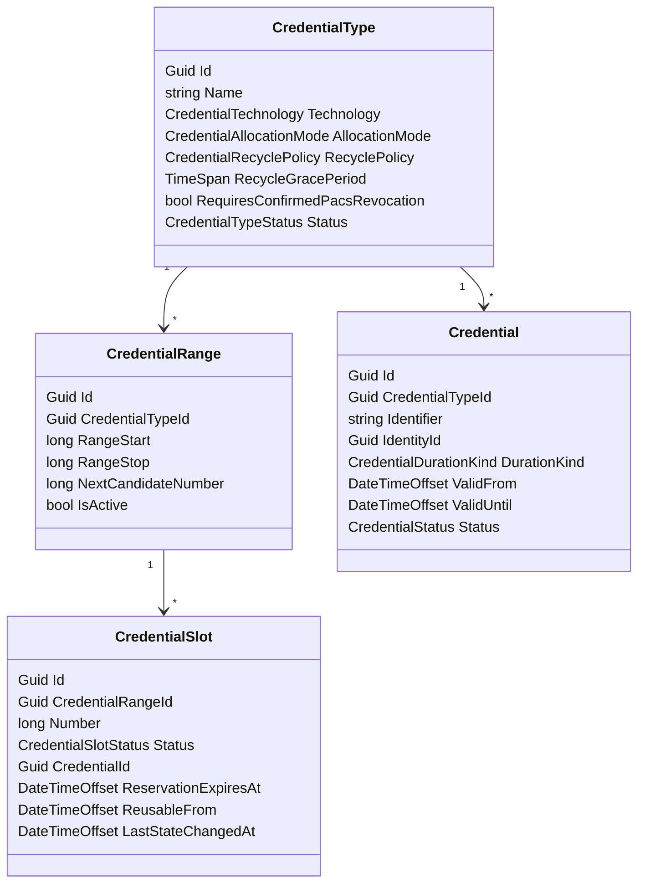

# Credential Management

`CredentialManagement` owns credential carriers, not access rights.

It owns:

- credential types and allocation modes
- optional credential ranges
- optional credential recycle policy
- credential number slot allocation state
- issued credentials
- credential validity

`CredentialType` defines how a credential is classified and allocated, such as `Visitor QR`, `Employee Desfire`, or `License Plate`.

`CredentialRange` exists only for range-allocated credential types.

`CredentialSlot` is sparse allocation state for one numeric value inside a range. Slot rows are created lazily only when a value is reserved, issued, cooling down, blocked, or explicitly freed for reuse. Missing row means the value is still unused and therefore free.

`Credential` is the issued credential.

`Credential` is an issuance record, not the allocation lock for a number forever. Historical credential rows may therefore reuse the same `Identifier` over time when the range slot has been safely recycled.



Boundary rules:

- Packages do not define credentials.
- Visitor or employee onboarding flows request credentials separately.
- Visitor QR numbers can be known immediately by issuing the credential up front.
- `Credential.Identifier` is not globally unique forever when a credential type allows recycling. Historical issuance rows may therefore share the same identifier over time.
- `CredentialTechnology` is descriptive and behavioral; it does not define uniqueness.
- `AllocationMode = Range` requires a numeric identifier inside an active `CredentialRange`.
- `AllocationMode = Provided` allows a caller-provided identifier, still tenant-globally unique.
- For range-allocated credentials, uniqueness and reuse safety are enforced by `CredentialSlot`, not by a forever-unique `Credential.Identifier` constraint.
- `CredentialSlot` rows are sparse. Fabric must not pre-create one row per numeric value in large ranges.
- `CredentialRange.NextCandidateNumber` is an allocator cursor, not proof that lower numbers are unavailable.
- Permanent credentials are allowed for recyclable credential types, but their slots do not become reusable until the credential is explicitly revoked/archived and all recycle-policy conditions are satisfied.

Access Control owns provider-native credential mapping and PACS work items:

- `CredentialTypeTarget`
  - links a business `CredentialTypeId` to an `AccessControlSystemId`
  - stores target-level `ProvisioningTiming`
  - may optionally store provider-native metadata such as `ProviderCredentialTypeId`
- provider-specific subtypes such as `UnipassCredentialTypeTarget` hold native PACS badge/credential-type details
- `CredentialPACSAssignment`
  - is the technical PACS work item for provisioning an issued credential
  - can fail terminally when the PACS or current integration does not support that credential technology
  - one Fabric `Credential` can have multiple `CredentialPACSAssignment` rows when one issued credential must exist in multiple PACS systems
  - uses statuses such as `Pending`, `Provisioned`, `RevocationPending`, `Revoked`, `FailedRetryable`, and `FailedTerminal`

Provisioning destination resolution:

- `CredentialTypeTarget` means a credential type can be provisioned into that PACS, not that every issued credential must be provisioned there.
- The issuance flow carries one or more requested `LocationId` values.
- Access Control resolves each requested location by nearest parent `AccessControlSystemLocation` link.
- Resolved destinations are normalized to distinct PACS coverage results before creating `CredentialPACSAssignment` rows.
- Example: Building A and Building B both resolve to Site A -> PACS BE, so one provisioning destination is created. Building C resolves to Site B -> PACS FR, so a second provisioning destination is created.

Current operational timing semantics:

- `Eager`: schedule PACS provisioning immediately.
- `AtValidFrom`: schedule PACS provisioning at UTC midnight on the `ValidFrom` date, not at the exact `ValidFrom` instant.

Current operational cleanup semantics:

- expired effective access-level `PACSProvisioning` rows are proactively revoked from PACS
- expired temporary `CredentialPACSAssignment` rows are proactively revoked from PACS
- permanent `CredentialPACSAssignment` rows are not removed by time-based expiry because the credential has no automatic expiry-based cleanup event

Range allocation and recycle rules:

```text
Allocation:
- use CredentialRange.NextCandidateNumber as a search cursor
- search for the next reusable number in the active range
- skip slots in Reserved, Issued, CoolingDown, or Blocked state
- wrap to RangeStart when RangeStop is reached
- reserve the chosen slot transactionally

Slot semantics:
- no CredentialSlot row means Free and never used
- Free means reusable and already has history
- Reserved means allocation in progress
- Issued means currently bound to an active credential issuance
- CoolingDown means waiting for recycle grace/revocation safety
- Blocked means administratively unavailable
```

Recommended allocation invariant:

- database uniqueness should protect `(CredentialRangeId, Number)` in `CredentialSlot`
- historical `Credential` rows provide audit trail for issued numbers over time
- number reuse is allowed only after slot state returns to `Free`

Recycle policy semantics:

```text
NeverReuse
- slot never returns to Free automatically after use

ReuseAfterExpiry
- temporary credential expiry is enough to start recycle flow

ReuseAfterRevocation
- slot becomes reusable only after credential is revoked and linked PACS assignments are revoked

ReuseAfterRevocationAndGrace
- same as ReuseAfterRevocation, then wait RecycleGracePeriod before slot returns to Free
```

Worker responsibilities:

- provisioning worker processes pending `CredentialPACSAssignment` rows
- expiry/recycle worker revokes expired temporary PACS assignments and advances reusable slots through `Issued -> CoolingDown -> Free`
- reservation-cleanup worker clears abandoned `CredentialSlot` reservations after `ReservationExpiresAt`

Audit model:

- `Credential` is the issuance history record
- Fabric keeps expired/revoked credential rows for audit
- Fabric does not need a separate `CredentialHistory` aggregate when each issuance gets its own `Credential` row
