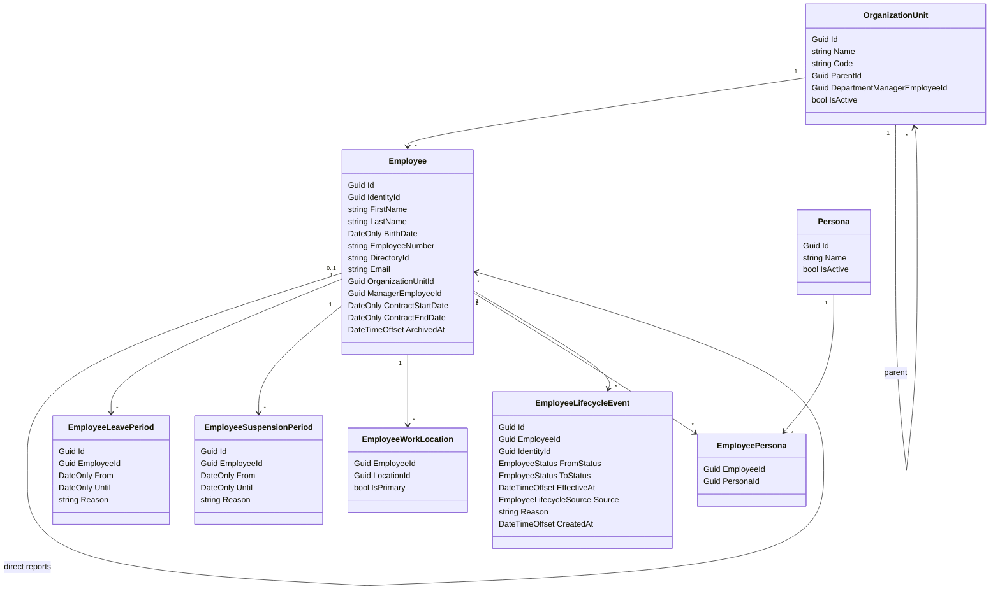

# Employees

`Employees` owns employee records, organization units, direct manager hierarchy, and the facts used to calculate employee lifecycle.

Employees are never created as unmapped placeholders. They are either manually registered or created/updated by an employee sync process.

Employee identity matching should prefer stable directory identity:

```text
1. Match by DirectoryId when present.
2. Fallback to Email when DirectoryId is absent.
3. If both are absent, require manual registration/matching.
```

`Employee` contains personal and workforce facts:



`Persona` is a normalized workforce classification. It allows customers to reduce many noisy job titles into a smaller set of access-relevant categories.

The longer-term persona pipeline is:

```text
Active Directory / HR Directory
-> Classification
-> Fabric Employees
```

The classification step translates customer-specific directory data into personas and employee facts that our system understands. This can start as custom integration code per customer and later become a rule engine or classifier.

Example:

```text
Raw job titles:
- Warehouse Operator Day Shift
- Warehouse Operator Night Shift
- Senior Warehouse Worker
- Logistics Associate
- Forklift Driver

Personas:
- Warehouse Staff
- Logistics
- Forklift Certified
```

An employee can embody multiple personas.

`EmployeeWorkLocation` captures the employee's current work locations. It is current-state only and has no validity dates because the source system is expected to send the current snapshot on each sync.

An employee can have multiple work locations:

```text
Sverre
- Site Leuven, primary
- Site Brussels
```

For package automation, all current work locations are used. `IsPrimary` is available for UX/default selection and future rules, but does not limit automation.

Status is calculated by a background process from durable facts:

```text
Today < ContractStartDate
=> PreHire

ContractStartDate <= Today
and (ContractEndDate is null or Today <= ContractEndDate)
=> Active

ContractEndDate < Today
=> Terminated
```

Overlays:

```text
Active leave period
=> Leave

Active suspension period
=> Suspended

ArchivedAt is set
=> Archived
```

Precedence:

```text
Archived
Suspended
Leave
PreHire
Active
Terminated
```

`EmployeeLifecycleWorker` periodically evaluates calculated status changes and records `EmployeeLifecycleEvent` records. `EmployeeLifecycleSaga` reacts to those events and coordinates side effects in other bounded contexts.

Boundary rules:

- Employees owns employee facts, OU hierarchy, manager hierarchy, and lifecycle events.
- Employees does not own access consequences.
- Manager is derived from direct reports, not manually assigned as an application role.
- `Admin` and `SecurityOfficer` are assigned authorization roles, not employee lifecycle states.
- Personas are employee classification facts, not access packages.
- Employee work locations are current-state facts from sync/manual registration; changes must be reconciled by automation.
