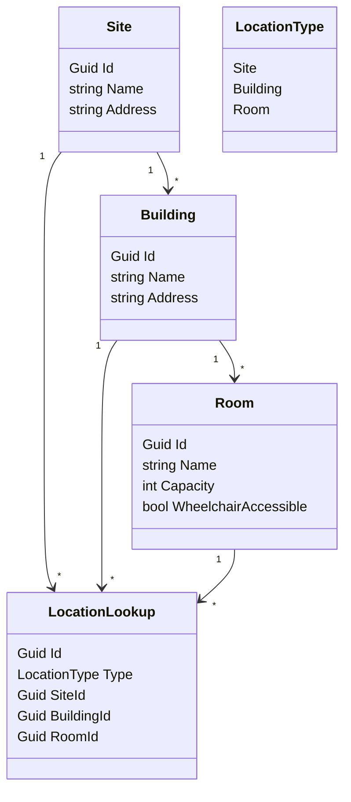

# Locations

`Locations` is its own bounded context. It is a foundational physical hierarchy that other contexts reference by id, but it does not know about PACS, packages, approvals, visitors, employees, or credentials.

Current implementation has `Site`, `Building`, and `Room`. Conceptually, access scoping may also use `Zone` later.

Boundary rules:

- Locations owns the hierarchy and location metadata.
- Other contexts store `LocationId` references.
- Linking PACS to locations does not belong in Locations; it belongs in Access Control.
