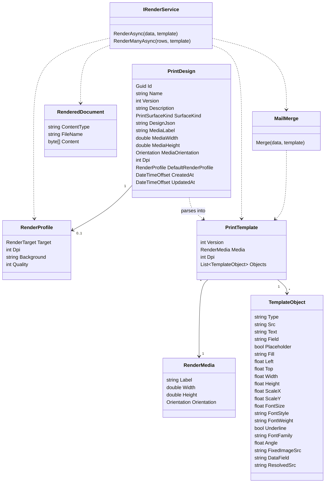

# Printing

`Printing` owns reusable visual print designs and Fabric's normalized render model for physical media.

It owns:

- persisted print designs
- media metadata for printable surfaces
- projection from editor JSON into Fabric's internal render model
- object-level field binding for rendering
- rendering services that produce image, PDF, or printer-native output

`Printing` exists because Fabric has two separate concerns that should not be mixed:

- chip encoding and card state changes for DESFire
- visual layout and rendering for cards, labels, and future printable media

`PrintDesign` is the persisted visual-design source of truth. It stores the full editor JSON blob so Fabric can reopen the design with no round-trip loss.

`PrintTemplate` is Fabric's normalized internal render model. It is derived from `PrintDesign.DesignJson` and keeps only the fields relevant to rendering.

`MailMerge` is Printing's shared personalization step. It merges runtime `Dictionary<string, string>` data into the current known string fields on a `PrintTemplate` by replacing `{{ DataPoint }}` tokens before rendering.

`RenderProfile` is Printing's render-configuration value object. It defines the target renderer and output settings used to turn a personalized `PrintTemplate` into a concrete artifact.

`RenderMedia` describes the physical printable media, such as CR80 card or shipping label stock.

`TemplateObject` is one renderable object inside a template. It represents text, image, placeholder, or other printable content after Fabric normalizes the editor JSON.

`IRenderService` converts a `PrintTemplate` plus runtime field values into a rendered artifact. The output may be an image, PDF, or future printer-native payload.

`RenderedDocument` is the renderer output artifact. It is a document or image ready for preview, storage, or hardware transport.



Source-of-truth rules:

- `PrintDesign.DesignJson` is the persisted canonical payload.
- `PrintTemplate` is derived from `DesignJson`.
- `PrintDesign.DefaultRenderProfile` is an optional persisted default render configuration.
- Fabric must preserve the original design JSON even when it can derive a normalized template from it.
- Media summary fields on `PrintDesign` are convenience fields for querying and list UX, not the canonical source.

Versioning rules:

- `PrintDesign` uses `Name + Version` versioning.
- Multiple versions of the same design name can exist.
- A render request should be explicit about which `PrintDesign` version it uses.

Rendering rules:

- Rendering consumes `PrintTemplate`, not raw editor JSON.
- Rendering order is `PrintTemplate -> MailMerge(data) -> RenderProfile resolution -> renderer-specific output`.
- Unknown editor-only Fabric fields should be ignored unless required for rendering correctness.
- Placeholder and field-bound objects resolve from runtime key-value data.
- `MailMerge` replaces `{{ DataPoint }}` tokens in the current known string fields on `PrintTemplate`, `RenderMedia`, and `TemplateObject`.
- `MailMerge` trims token whitespace during lookup and leaves unknown tokens unchanged.
- `RenderProfile` is a value object, not a separately managed aggregate or preset entity.
- Effective render profile precedence is request or job override, then `PrintDesign.DefaultRenderProfile`, then system fallback.
- Current fallback render profile is BMP at 300 DPI.
- The same `PrintDesign` may be rendered multiple times with different runtime data.

Boundary rules:

- `Printing` owns visual print layout.
- `Desfire` does not own visual print layout.
- `CredentialManagement` does not own visual print layout.
- `Hardware` does not own print-design persistence or render-model normalization.
- Hardware transport should consume `Printing` output, not define Fabric's canonical visual model.

DESFire integration rules:

- `ChipDesign` remains chip-only.
- `Transformation` remains chip-only.
- DESFire print flows may reference a `PrintDesign`, but must not embed visual layout inside DESFire aggregates.
- A DESFire encoding flow can exist without any linked `PrintDesign`.

Label-printing rules:

- Label printing reuses the same `Printing` bounded context.
- Card designs and label designs are both `PrintDesign`.
- `SurfaceKind` distinguishes the intended printable medium family.
- Different renderers may exist for different surface kinds or printer targets without splitting the design library.

Dependency direction summary:

```text
Printing -> Hardware by rendered output and print transport contracts
Desfire -> Printing by PrintDesign reference in print-capable execution flows
Label print flows -> Printing by PrintDesign reference and render request
CredentialManagement -> Printing by optional default-design reference only, never by ownership
```

Avoid cross-context ownership:

- Printing does not own chip transformations.
- Printing does not own hardware devices or hardware availability.
- Desfire does not own card front design JSON.
- Hardware does not own print-design versioning.
- CredentialManagement does not own template rendering rules.
