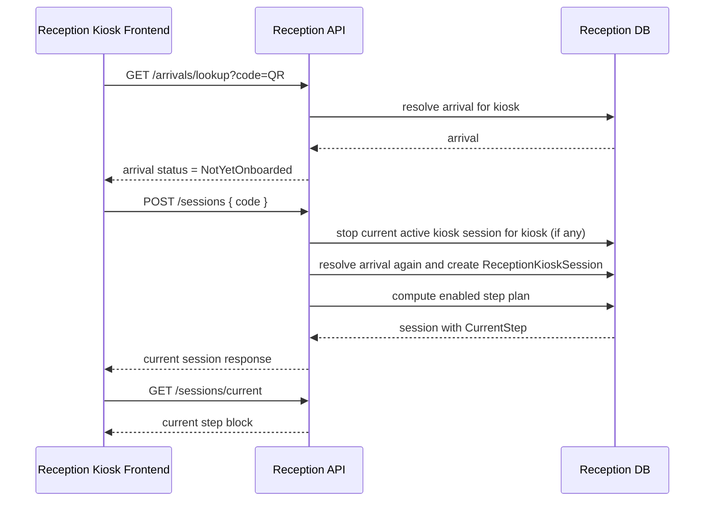
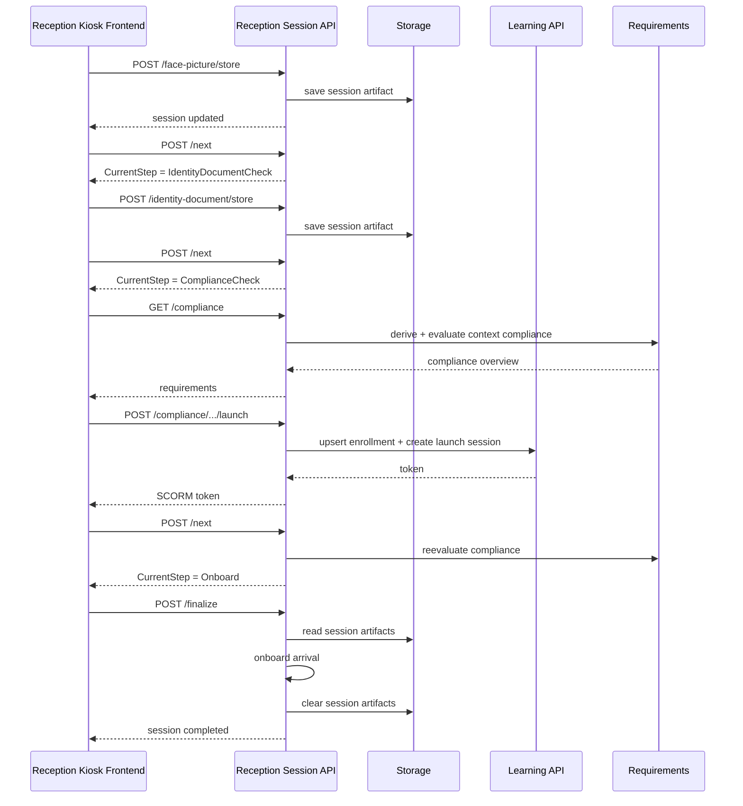
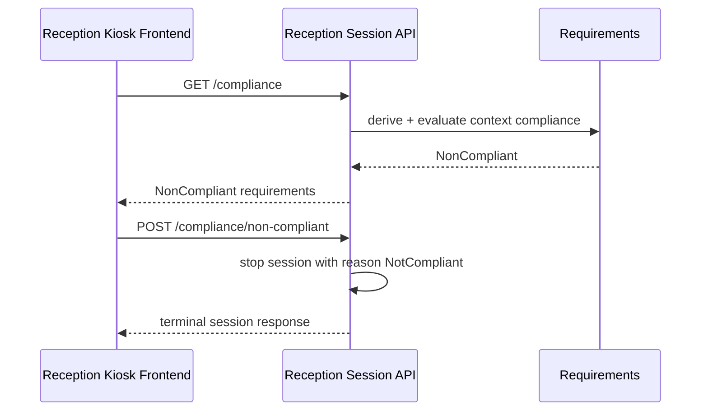
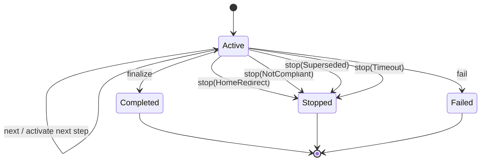
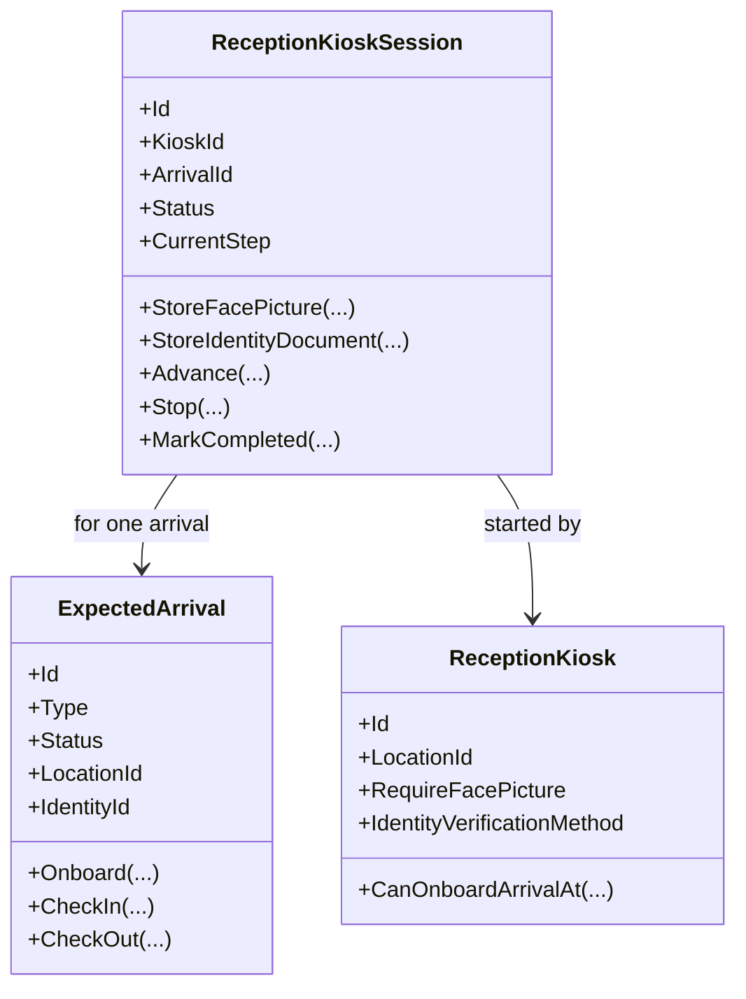

# Reception Kiosk

`Reception` owns reception self-service onboarding sessions for expected arrivals served by a reception kiosk.

This document describes the current direction:

- QR resolves the arrival.
- if the arrival is already onboarded, the kiosk uses the direct check-in/check-out path.
- if the arrival is not yet onboarded, the kiosk starts a durable `ReceptionKioskSession`.
- the backend owns the step order and the current step.
- the frontend executes the current step and asks the backend to progress.

## Purpose

The reception kiosk flow exists to answer:

```text
For this kiosk and this scanned QR code, what is the current arrival action, what onboarding step is active, what temporary session data exists, and may the arrival be finalized into onboarded state?
```

## Current Split

- `Reception` owns expected arrivals, kiosk config, kiosk onboarding sessions, kiosk session step progression, and final onboarding.
- `Learning` owns course enrollments, SCORM launch sessions, attempts, and course completion facts.
- `Requirements` owns requirement policy, evidence, and compliance evaluation.
- session capture files live in platform storage via `IStorage`, but the owning domain is still `Reception`.

## Current High-Level Behavior

Current scan behavior:

```text
scan QR
-> resolve arrival for kiosk
-> if arrival status = Onboarded
   -> direct check-in/check-out path
-> if arrival status = NotYetOnboarded
   -> start ReceptionKioskSession
   -> execute current backend-owned step
-> if arrival status = Offboarded
   -> terminal / visit completed
```

Future direction:

```text
scan QR
-> if arrival status = Onboarded
   -> start separate check-in session
-> else
   -> start onboarding session
```

Check-in is intentionally still direct today. The durable session model is focused on onboarding first.

## Ubiquitous Language

`ReceptionKioskSession` is one durable onboarding run for one kiosk and one arrival.

`CurrentStep` is the single active backend-owned onboarding step.

`Next` is the happy-path transition command. It only advances when the current step is complete.

`Stop` is a terminal command. It ends the session from any step with a stop reason and optional free-text message.

`Finalize` is the final onboarding command. It validates that required steps are complete, promotes stored session artifacts into onboarding documents, and calls the arrival onboard operation.

`Session Artifact` is temporary step data owned by the session, such as face picture or identity document picture.

## Session Aggregate

The current aggregate shape is:

```text
ReceptionKioskSession
- Id
- KioskId
- ArrivalId
- Status                  // Active, Completed, Stopped, Failed
- CurrentStep             // FacePicture, IdentityDocumentCheck, ComplianceCheck, Onboard
- StopReason?
- StopMessage?
- StartedAt
- LastInteractionAt
- CompletedAt?
- RetentionUntil
- RequiresFacePicture
- RequiresIdentityDocumentCheck
- RequiresComplianceCheck
- FacePictureStatus
- IdentityDocumentCheckStatus
- ComplianceCheckStatus
- OnboardStatus
- FacePictureStoragePath?
- IdentityDocumentStoragePath?
```

The session freezes the step plan at session start. Later kiosk config changes do not reshape an already-started session.

## Step Model

The current hardcoded onboarding order is:

1. `FacePicture`
2. `IdentityDocumentCheck`
3. `ComplianceCheck`
4. `Onboard`

Enabled/disabled at session start:

- `FacePicture` when kiosk requires a face picture.
- `IdentityDocumentCheck` when kiosk identity verification method is `Picture`.
- `ComplianceCheck` when the arrival has a location and the derived context has one or more requirements.
- `Onboard` always.

Disabled steps are marked `Skipped` immediately.

Important rule:

- `Next` models only the happy path.
- if the happy path is not available, the step does not advance.
- exception or blocked outcomes should be handled inside the step and usually terminate the session.

Examples:

```text
FacePicture
- store image
- Next succeeds only when image exists
```

```text
ComplianceCheck
- list compliance
- launch course
- if non-compliant remains unresolved, call a terminal endpoint and stop the session
- do not advance to Onboard on the unhappy path
```

## Session Artifacts

Temporary captures are stored in storage, not the DB.

Rules:

- a session stores only storage references
- captures are temporary session state
- arrival onboarding documents are the permanent target
- finalization reads the session artifacts, creates onboarding documents, then clears session-owned artifact refs

Important boundary rule:

- do not write session artifacts directly into `ExpectedArrival.Documents` before finalization

## Retention

Current retention rule:

```text
terminal sessions are retained for 30 days
-> cleanup worker deletes session rows older than RetentionUntil
-> cleanup worker also deletes any remaining storage artifacts owned by the session
```

## Timeout

Current timeout behavior:

- an active session times out after idle inactivity
- timeout is modeled as a terminal stop reason
- current implementation checks timeout opportunistically when reading or mutating the current session

Timeout is session behavior, not a frontend-only behavior.

## API Model

Current session-driven endpoints:

```text
POST /api/reception/kiosk/sessions
GET  /api/reception/kiosk/sessions/current
POST /api/reception/kiosk/sessions/current/next
POST /api/reception/kiosk/sessions/current/stop
POST /api/reception/kiosk/sessions/current/face-picture/store
POST /api/reception/kiosk/sessions/current/identity-document/store
GET  /api/reception/kiosk/sessions/current/compliance
POST /api/reception/kiosk/sessions/current/compliance/requirements/{requirementDefinitionId}/launch
POST /api/reception/kiosk/sessions/current/compliance/non-compliant
POST /api/reception/kiosk/sessions/current/finalize
```

Current direct arrival actions remain:

```text
GET  /api/reception/kiosk/arrivals/lookup
POST /api/reception/kiosk/arrivals/{id}/check-in
POST /api/reception/kiosk/arrivals/{id}/check-out
```

Those direct check-in/check-out endpoints are still used only for already-onboarded arrivals.

## Sequence: Start Onboarding Session



## Sequence: Happy Path Onboarding



## Sequence: Non-Compliant Terminal Path



## Session State UML



## Aggregate/Class UML



## Frontend Working Model

The frontend should be a thin step executor.

Rules:

- do not calculate canonical step order in the browser
- do not decide whether final onboarding is allowed
- do not own the canonical session state in `sessionStorage`
- render the step indicated by `GET /sessions/current`
- call step action endpoints
- call `next` only for happy path progression
- call `stop` or a terminal step endpoint for unhappy path exits

Transient browser state is still acceptable for:

- local camera preview before upload
- active SCORM launch token while the course player is open

## Future Extension Points

The step model is intentionally ordered and hardcoded today, but future enabled steps can be inserted without changing the core session concept.

Examples:

- `PrintLabel`
- `DispenseCard`
- later separate `CheckInSession`

Recommended rule:

- add a new real step only when it is a business stage in the session plan
- sub-actions inside a stage should stay step-local and not become new top-level steps by default

## Out of Scope Today

- check-in session as a separate durable process
- reception desk/admin UI for browsing historical kiosk sessions
- persisted compliance snapshots on terminal outcomes
- automatic notification workflow beyond explicit terminal endpoints
