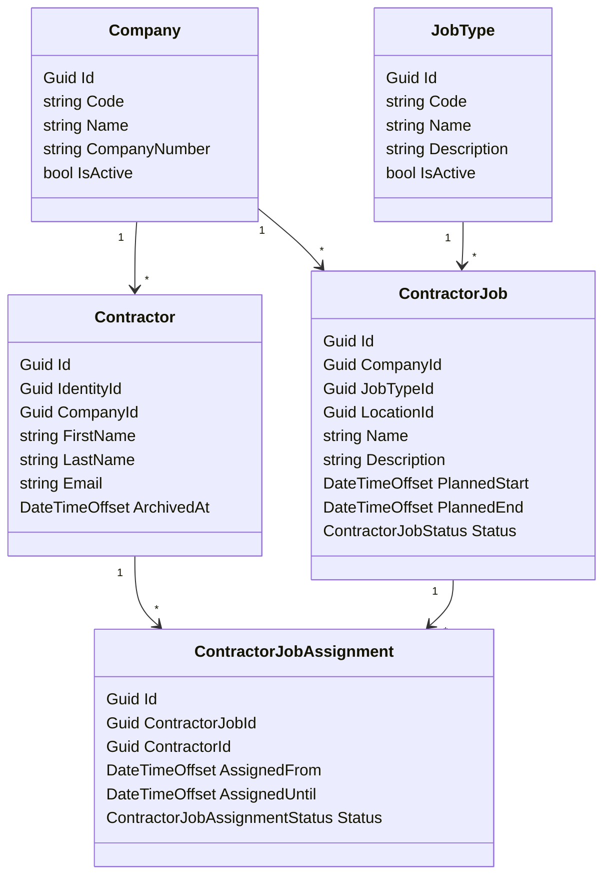

# Contractors

This document describes the `Contractors` bounded context.

`Contractors` owns contractor companies, contractors, contractor job types, contractor jobs, and contractor job assignments.

Core separation:

- `Contractors` owns who the contractor is, which company they work for, and which jobs they are assigned to.
- `Locations` owns the physical location hierarchy.
- `Requirements` owns enforcement zones, requirement policy, and compliance.
- `ReceptionDesk` owns expected arrivals and expected end plus grace.
- automation/sagas coordinate contractor side effects into `ReceptionDesk`, `Requirements`, and other contexts.

## Purpose

The `Contractors` bounded context exists to answer:

```text
Which contractors from which company are assigned to which work at which location and during which time window?
```

The context must support:

- persistent contractors
- contractor linked to exactly one current company
- jobs owned by a company
- one job has exactly one job type
- jobs planned for a location
- many contractors assigned to one job
- one contractor assigned to many jobs
- assignment windows that cannot outlive the job window

## Core Domain Rules

- `Contractor` is persistent, not recreated per visit.
- `Contractor` belongs to one `Company`.
- `Company` can have many contractors.
- `Company` can have many jobs.
- one `ContractorJob` has exactly one `JobType`.
- one `ContractorJob` points to one `LocationId`.
- one `ContractorJobAssignment` links one contractor to one job for one actual assignment window.
- `ContractorJobAssignment.AssignedUntil` must not be after `ContractorJob.PlannedEnd`.
- one contractor can have multiple active assignments at the same time.
- if multiple active assignments resolve to the same enforcement zone, requirement evaluation uses the union of active job types.
- one contractor can have active assignments in multiple enforcement zones on the same day.

## Company

`Company` is the contractor employer or legal external organization.

Recommended shape:

```text
Company
- Id
- Code
- Name
- CompanyNumber
- IsActive
```

`Company` answers:

```text
Which external organization employs or represents this contractor?
```

V1 note:

- company-level requirement policy is out of scope for v1

## Contractor

`Contractor` is the persistent external worker record linked to an `IdentityId`.

Recommended shape:

```text
Contractor
- Id
- IdentityId
- CompanyId
- FirstName
- LastName
- Email
- ArchivedAt
```

`Contractor` answers:

```text
Which external person is this, and which company do they currently belong to?
```

Important rule:

- `Contractor` is not time-boxed by one visit or one job

## Job Type

`JobType` is the access-relevant work classification used by requirements.

Examples:

- `Welding`
- `Electrical`
- `Scaffolding`
- `Maintenance`

Recommended shape:

```text
JobType
- Id
- Code
- Name
- Description
- IsActive
```

`JobType` answers:

```text
What kind of work is being performed?
```

## Contractor Job

`ContractorJob` is a company-owned work item planned for one location and one job type.

Recommended shape:

```text
ContractorJob
- Id
- CompanyId
- JobTypeId
- LocationId
- Name
- Description
- PlannedStart
- PlannedEnd
- Status
```

Status examples:

- `Planned`
- `Active`
- `Completed`
- `Cancelled`

Important rules:

- one job has exactly one `JobType`
- one job points to one `LocationId`
- the location later resolves to an `EnforcementZone` in `Requirements`

`ContractorJob` answers:

```text
What work is this company doing, where, and during which planned window?
```

## Contractor Job Assignment

`ContractorJobAssignment` links a contractor to a job for the actual assignment window.

Recommended shape:

```text
ContractorJobAssignment
- Id
- ContractorJobId
- ContractorId
- AssignedFrom
- AssignedUntil
- Status
```

Status examples:

- `Planned`
- `Active`
- `Completed`
- `Cancelled`

Important rules:

- `AssignedUntil <= ContractorJob.PlannedEnd`
- assignment window is the person-specific authorization window for that job
- different contractors on the same job can have different assignment windows

`ContractorJobAssignment` answers:

```text
Is this contractor assigned to this job right now, and until when?
```

## Location And Enforcement Zone Resolution

`Contractors` stays location-based.

Recommended rule:

- `ContractorJob` references `LocationId`
- `Requirements` resolves that `LocationId` to the applicable `EnforcementZone` set on the location ancestor path

This keeps responsibilities clean:

- `Locations` owns physical structure
- `Contractors` owns work planning
- `Requirements` owns compliance perimeter policy

This also means:

- employees can stay location-based
- visitors can stay location-based
- contractor jobs can stay location-based
- enforcement logic does not have to leak into every other domain model

Nested-zone example:

```text
Location tree:
- Site BNP
  - Building A
    - IT Server Room

Zone mappings in Requirements:
- Site BNP -> EF1 Company Perimeter
- IT Server Room -> EF2 IT Server Room

Contractor job at IT Server Room
-> applicable enforcement zones = EF1 + EF2
-> contractor must satisfy both zone compliances
```

## Multiple Active Jobs

One contractor can have multiple active assignments at the same time.

If multiple active assignments resolve to the same enforcement zone:

- collect all active `JobTypeId` values
- apply contractor zone requirements
- union all matched contractor job-type requirements

Example:

```text
Contractor A
- Assignment 1: Welding at Antwerp Building A
- Assignment 2: Electrical at Antwerp Building B

Both locations resolve to EnforcementZone Antwerp HQ
-> effective contractor job types in zone = Welding + Electrical
-> requirements = zone contractor requirements + welding requirements + electrical requirements
```

If assignments resolve to different enforcement zones on the same day:

- compute compliance separately per zone
- each zone gets its own access validity window

## Reception Desk Integration

`ReceptionDesk` is the operational expected-arrival context, not the owner of contractor jobs.

Recommended flow:

```text
Contractors
-> ContractorLifecycleSaga
-> ReceptionDesk expected arrival / expected end + grace
```

Meaning:

- contractor jobs and assignments are source business facts
- `ReceptionDesk` keeps the operational arrival-side view needed for check-in and expected time windows
- changes in contractor planning can project into `ReceptionDesk` through saga coordination

## Requirement Integration

`Requirements` should consume contractor planning facts but not own them.

For compliance in one enforcement zone:

```text
1. Resolve active ContractorJobAssignment rows for contractor.
2. Join to ContractorJob rows.
3. Resolve each job LocationId to the applicable enforcement zones on the ancestor path.
4. Filter to jobs whose applicable zones include the target EnforcementZone.
5. Collect active JobTypeId values.
6. Compute requirement compliance for that union of job types.
```

If a contractor job location resolves to no enforcement zone on the target location or any ancestor:

- no requirement policy applies for that job location

Contractor validity rule in `Requirements`:

```text
ZoneCompliance.ValidUntil =
  min(
    ReceptionDesk expected arrival end + grace,
    earliest active ContractorJobAssignment.AssignedUntil in the zone,
    earliest fulfilled requirement expiry
  )
```

This ensures zone access cannot outlive:

- the expected contractor presence window
- the contractor's assignment to the work
- the evidence used to justify compliance

## Boundary Rules

- `Contractors` owns company, contractor, job type, job, and assignment data.
- `Contractors` references `IdentityId` and `LocationId`.
- `Contractors` does not own enforcement zones.
- `Contractors` does not own requirement policy or compliance.
- `Contractors` does not own expected-arrival operational records in `ReceptionDesk`.
- `Requirements` may read contractor job and assignment facts to determine active job types per zone.

## Mermaid Model



## Example

Setup:

```text
Company:
- Acme Industrial Services

Contractors:
- Alice
- Bob

JobTypes:
- Welding
- Electrical

ContractorJobs:
- Boiler repair / Antwerp Building A / Welding / Mon-Fri
- Panel replacement / Antwerp Building B / Electrical / Tue-Fri

Assignments:
- Alice -> Boiler repair / Mon-Fri
- Alice -> Panel replacement / Tue-Fri
- Bob -> Boiler repair / Wed-Fri
```

Interpretation:

```text
Alice has 2 active jobs.
Both job locations resolve to the same enforcement zone.
-> active job types in that zone = Welding + Electrical
-> requirements uses the union of both job-type requirement sets
```

Nested-zone interpretation:

```text
If Boiler repair is planned at IT Server Room and that room resolves to:
- EF1 Company Perimeter
- EF2 IT Server Room

Alice must be compliant for both EF1 and EF2.
```

## Open Decisions

- Can one enforcement zone map to multiple sibling locations, or only one site subtree?
- If a contractor job location resolves to no enforcement zone, contractor requirements are skipped for that job location.
