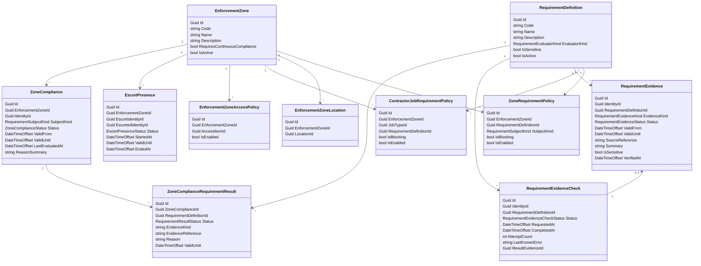

# Requirements

This document describes the `Requirements` bounded context.

`Requirements` owns requirement definitions, enforcement zones, requirement policies, evidence used to fulfill requirements, and the computed current compliance state per identity and enforcement zone.

Core separation:

- `Requirements` owns what must be true for a person to enter or remain inside an enforcement zone.
- `Requirements` also owns basic certificate-like evidence such as uploaded VCA or site training proof.
- `Locations` owns the physical location hierarchy.
- `Contractors` owns contractor companies, contractors, jobs, and job assignments.
- `AccessCatalog` owns package/grant policy, not requirement compliance.
- `AccessControl` owns PACS mappings and technical enforcement, not requirement policy.
- `ReceptionDesk` owns expected arrivals and their expected end time plus grace.
- automation/application services coordinate reevaluation and projection of compliance into access state.

## Purpose

The `Requirements` bounded context exists to answer:

```text
Is this identity currently compliant for this enforcement zone, and until when?
```

The context must support:

- zone-wide requirements for employees
- zone-wide requirements for visitors
- zone-wide requirements for contractors
- extra contractor requirements based on one or more active job types
- multiple evidence mechanisms, not only uploaded certificates
- pre-arrival compliance so PACS access can be provisioned before arrival
- optional continuous compliance for sensitive scenarios

## Core Domain Rules

- `EnforcementZone` is first-class.
- enforcement zones can be cumulative through the location ancestor path.
- one person can be compliant for multiple enforcement zones at the same time.
- employees and visitors are evaluated only against zone-level requirements.
- contractors are evaluated against zone-level requirements plus extra job-type requirements.
- contractor jobs stay location-based; `Requirements` resolves job locations into enforcement zones.
- if a contractor has multiple active job types for the same zone, effective requirements are the union of all matched job-type requirements.
- requirement compliance drives whether access for the zone should exist, but the PACS mapping itself remains in `AccessControl`.
- compliance is stored as computed current state because access control needs the answer before access is pushed.

## Enforcement Zone

`EnforcementZone` is the business boundary where compliance matters.

Typical meaning:

- a company perimeter
- a protected site area
- a fenced contractor area

Recommended shape:

```text
EnforcementZone
- Id
- Code
- Name
- Description
- RequiresContinuousCompliance
- IsActive
```

Property meaning:

- `Code`: stable machine-readable key.
- `RequiresContinuousCompliance`: whether compliance only matters before entry or also while inside the zone.
- `IsActive`: administrative enablement flag.

`EnforcementZone` answers:

```text
Inside which business perimeter do these requirements apply?
```

## Enforcement Zone Location Mapping

`EnforcementZone` should stay separate from `Location`.

`Location` remains the shared physical reference used by employees, visitors, contractor jobs, and reception.

`Requirements` owns the mapping from physical location scope to compliance perimeter.

Recommended shape:

```text
EnforcementZoneLocation
- Id
- EnforcementZoneId
- LocationId
```

Resolution rules:

- a location can have zero or one directly attached enforcement zone
- an enforcement zone can cover one or more locations through hierarchy
- applicable enforcement zones for a target location are cumulative across the ancestor path
- sibling or cross-branch overlap is not allowed
- contractor jobs, visits, and other location-based contexts resolve applicable zones through this mapping

This keeps responsibilities clean:

- `Locations` owns physical hierarchy
- `Requirements` owns compliance perimeter policy

Ancestor-path example:

```text
Location tree:
- Site BNP
  - Building A
    - IT Server Room

Zone mappings:
- Site BNP -> EF1 Company Perimeter
- IT Server Room -> EF2 IT Server Room

Applicable zones for IT Server Room:
- EF1 Company Perimeter
- EF2 IT Server Room
```

Meaning:

- access to `IT Server Room` requires compliance for both `EF1` and `EF2`
- if no enforcement zone is linked on the target location or any ancestor, no requirement policy applies

## Requirement Definition

`RequirementDefinition` represents one business requirement meaning.

Examples:

- `site_safety_training`
- `vca_certified`
- `not_ocad_blacklisted`
- `escort_required`
- `max_hours_per_day`
- `max_consecutive_days_on_site`

Recommended shape:

```text
RequirementDefinition
- Id
- Code
- Name
- Description
- EvaluatorKind
- IsSensitive
- IsActive
```

Property meaning:

- `EvaluatorKind`: code-level evaluator used to interpret evidence and compute requirement compliance.
- `IsSensitive`: marks requirements whose evidence or failures need extra care.
- `IsActive`: administrative enablement flag.

Evaluator examples:

- `UploadedDocument`
- `ExternalCheck`
- `Escort`
- `Computed`

`RequirementDefinition` answers:

```text
What does this requirement mean, and which evaluator decides compliance?
```

It does not answer where it applies.

## Zone Requirement Policy

`ZoneRequirementPolicy` applies a requirement directly to an enforcement zone for a subject kind.

This is the only requirement policy used for employees and visitors.

It can also apply to contractors when the requirement is zone-wide and not tied to a job type.

Recommended shape:

```text
ZoneRequirementPolicy
- Id
- EnforcementZoneId
- RequirementDefinitionId
- SubjectKind
- IsBlocking
- IsEnabled
```

Subject examples:

- `Employee`
- `Visitor`
- `Contractor`
- `Any`

Examples:

- Antwerp zone requires `site_safety_training` for `Any`
- Antwerp zone requires `not_ocad_blacklisted` for `Contractor`
- Antwerp zone requires `escort_required` for `Visitor`

## Contractor Job Requirement Policy

`ContractorJobRequirementPolicy` adds extra requirements for contractors based on job type inside a zone.

Recommended shape:

```text
ContractorJobRequirementPolicy
- Id
- EnforcementZoneId
- JobTypeId
- RequirementDefinitionId
- IsBlocking
- IsEnabled
```

Examples:

- Antwerp zone + `Welding` job type requires `hot_work_training`
- Antwerp zone + `Electrical` job type requires `electrical_safety_certificate`

This model keeps the common perimeter policy separate from extra contractor work-risk policy.

## Enforcement Projection

Requirement compliance must still map to something concrete in `AccessControl`.

`Requirements` should therefore own a zone-to-business-access mapping concept, while native PACS mapping stays in `AccessControl`.

Recommended shape:

```text
EnforcementZoneAccessPolicy
- Id
- EnforcementZoneId
- AccessItemId
- IsEnabled
```

Meaning:

- if the identity is compliant for the zone, automation/application services ensure the linked `AccessItem` is granted or remains granted
- `AccessControl` then resolves that `AccessItem` into PACS targets

This keeps requirement policy and physical PACS implementation cleanly separated.

## Requirement Evidence

`RequirementEvidence` is the umbrella evidence model used to fulfill requirements.

It covers:

- uploaded certificates or documents such as VCA
- imported or manually attested proof such as site training completion
- dynamic external check results such as OCAD
- computed evidence outcomes

Recommended shape:

```text
RequirementEvidence
- Id
- IdentityId
- RequirementDefinitionId
- EvidenceKind
- Status
- ValidFrom
- ValidUntil
- SourceReference
- Summary
- IsSensitive
- VerifiedAt
```

Property meaning:

- `EvidenceKind`: uploaded document, external check, manual attestation, computed, escort presence reference.
- `Status`: factual evidence status such as `Valid`, `Invalid`, `Expired`, or `Pending`.
- `ValidFrom` / `ValidUntil`: evidence validity interval if present.
- `SourceReference`: external correlation id, document id, or source key.
- `Summary`: safe short description.
- `VerifiedAt`: when Fabric accepted or confirmed the evidence.

Important rule:

- uploaded certificates are not a separate bounded context
- they are one evidence type inside `Requirements`

## Requirement Evidence Check

`RequirementEvidenceCheck` stores the operational work state for dynamic evaluators that may need to call external systems.

This is mainly for evidence such as OCAD.

Recommended shape:

```text
RequirementEvidenceCheck
- Id
- IdentityId
- RequirementDefinitionId
- Status
- RequestedAt
- CompletedAt
- AttemptCount
- LastKnownError
- ResultEvidenceId
```

Property meaning:

- `Status`: operational state such as `Pending`, `InProgress`, `Succeeded`, `FailedRetryable`, `FailedTerminal`
- `ResultEvidenceId`: resulting `RequirementEvidence` row if the check completed

Important rule:

- `RequirementEvidenceCheck` stores operational work state
- `RequirementEvidence` stores the factual result used by compliance

## Escort Use Case

Escort is modeled as a normal requirement definition with a special evaluator kind.

Recommended setup:

```text
RequirementDefinition
- Code: escort_required
- EvaluatorKind: Escort
```

Zone policy example:

```text
ZoneRequirementPolicy
- EnforcementZone: Antwerp HQ
- SubjectKind: Visitor
- RequirementDefinition: escort_required
```

Important rule:

- the escort requirement is attached only to `Visitor`
- employees and contractors do not match that policy unless explicitly configured

Recommended evidence model:

```text
EscortPresence
- Id
- EnforcementZoneId
- EscortIdentityId
- EscortedIdentityId
- Status
- StartedAt
- ValidUntil
- EndedAt
```

Behavior examples:

- PACS-assisted escort flow can create `EscortPresence` for a short zone-entry window
- continuous mode can end the presence early if the escort leaves first

If `escort_required` is only an entry condition:

- a short validity window is enough

If `escort_required` must remain true while inside:

- zone should set `RequiresContinuousCompliance = true`
- escort presence should remain active while both identities remain inside

## Effective Requirement Resolution

Employee or visitor in zone:

```text
effective requirements =
  all enabled ZoneRequirementPolicy
  where EnforcementZoneId matches
  and SubjectKind matches employee/visitor or Any
```

Contractor in zone:

```text
effective requirements =
  all enabled ZoneRequirementPolicy
  where EnforcementZoneId matches
  and SubjectKind matches Contractor or Any
  union
  all enabled ContractorJobRequirementPolicy
  where EnforcementZoneId matches
  and JobTypeId matches any active contractor job type in this zone/context
```

Multiple contractor job types:

```text
Welding + Electrical
-> union of welding requirements and electrical requirements
```

This is intentionally conservative and easy to explain.

Contractor source facts:

```text
- active contractor jobs stay in `Contractors`
- contractor jobs reference LocationId
- Requirements resolves job LocationId -> applicable EnforcementZone set on the ancestor path
- active JobTypeId values for that zone drive ContractorJobRequirementPolicy matching
```

Target-location rule:

```text
For a contractor job at a target location:
- collect all applicable enforcement zones from the target location ancestor path
- compute compliance separately for each applicable zone
- grant access only when the contractor is compliant for every required zone on that path
```

## Zone Compliance

`ZoneCompliance` is the computed current-state answer for one identity in one enforcement zone.

This is the primary output of the bounded context because `AccessControl` needs this answer before zone access is pushed.

Important rule:

- compliance is per `(IdentityId, EnforcementZoneId)`
- nested zones therefore produce multiple compliance states for the same person

Recommended shape:

```text
ZoneCompliance
- Id
- EnforcementZoneId
- IdentityId
- SubjectKind
- Status
- ValidFrom
- ValidUntil
- LastEvaluatedAt
- ReasonSummary
```

Status examples:

- `Compliant`
- `NonCompliant`
- `Pending`

Per-requirement result shape:

```text
ZoneComplianceRequirementResult
- Id
- ZoneComplianceId
- RequirementDefinitionId
- Status
- EvidenceKind
- EvidenceReference
- Reason
- ValidUntil
```

Important rule:

- `ZoneCompliance` stores the current effective answer
- `ZoneComplianceRequirementResult` stores why each matched requirement currently passes or fails

## Validity Rules

Employees:

```text
ZoneCompliance.ValidUntil =
  earliest fulfilled requirement expiry
  or null if all fulfilled requirements are non-expiring
```

Visitors:

```text
ZoneCompliance.ValidUntil =
  min(
    expected arrival end from ReceptionDesk + grace,
    earliest fulfilled requirement expiry
  )
```

Contractors:

```text
ZoneCompliance.ValidUntil =
  min(
    expected arrival end from ReceptionDesk + grace,
    earliest active contractor assignment end in the zone context,
    earliest fulfilled requirement expiry
  )
```

Meaning:

- if a visitor or contractor has expected presence until end of week, zone access can last until end of week plus grace
- contractor access must still stop when the active assignment ends, even if the ReceptionDesk window is longer
- unless one fulfilled requirement expires sooner, such as VCA, OCAD freshness, or escort window

If a blocking requirement is missing or failed:

- `ZoneCompliance.Status = NonCompliant`
- no usable zone access should exist

## Reevaluation Model

Compliance should be recalculated whenever relevant evidence or context changes.

Primary triggers:

- uploaded evidence created, approved, rejected, or expired
- external check result arrived
- escort presence started, ended, or expired
- active contractor job or contractor assignment changed
- expected arrival end or grace changed in `ReceptionDesk`
- enforcement zone location mapping changed
- zone requirement policy changed
- time reached an existing compliance or evidence expiry boundary

Evaluator behavior is code-driven.

Examples:

- `UploadedDocument` evaluator decides whether uploaded VCA evidence fulfills the requirement and until when
- `ExternalCheck` evaluator decides when OCAD must be rechecked and how long the result remains fresh
- `Escort` evaluator decides whether active escort presence exists for the zone
- `Computed` evaluator decides compliance for legal/meta requirements such as max hours or max consecutive days

Recommended high-level flow:

```text
1. Determine target location from current enforcement context.
2. Resolve all applicable enforcement zones from the target location ancestor path.
3. For each applicable enforcement zone, resolve effective requirements for identity, subject kind, and active contractor job types.
4. For each requirement, run the evaluator:
   - read current evidence
   - trigger external check if needed
   - compute compliance if needed
   - inspect escort presence if needed
5. Compute current ZoneCompliance and ZoneComplianceRequirementResult rows for each applicable zone.
6. If compliant, ensure EnforcementZoneAccessPolicy access exists through AccessControl integration.
7. If non-compliant or expired for any required zone, revoke or withhold that zone access.
```

## Boundary Rules

- `Requirements` owns requirement definitions, enforcement zones, requirement policies, evidence, and computed compliance state.
- `Requirements` owns enforcement-zone-to-location mapping.
- `Requirements` references `IdentityId` for the evaluated subject.
- `Requirements` references `AccessItemId` only as business access to project compliance into enforcement.
- `Requirements` consumes contractor job and assignment facts from `Contractors` to determine active job types per zone.
- `Requirements` does not own package requests, approvals, or grants.
- `Requirements` does not own PACS-native objects, PACS targets, or cardholder provisioning.
- `ReceptionDesk` owns expected arrivals and expected end plus grace.
- `Requirements` consumes that timing input when calculating visitor and contractor compliance validity.

## Mermaid Model



## Example: Zone-Wide Requirements

Setup:

```text
EnforcementZone:
- Antwerp HQ

RequirementDefinitions:
- site_safety_training
- not_ocad_blacklisted

ZoneRequirementPolicy:
- Antwerp HQ + Any -> site_safety_training
- Antwerp HQ + Contractor -> not_ocad_blacklisted

EnforcementZoneAccessPolicy:
- Antwerp HQ -> AccessItem Antwerp HQ Entry
```

Behavior:

```text
Employee entering Antwerp HQ:
- required: site_safety_training

Visitor entering Antwerp HQ:
- required: site_safety_training

Contractor entering Antwerp HQ:
- required: site_safety_training
- required: not_ocad_blacklisted
```

## Example: Contractor With Two Job Types

Setup:

```text
EnforcementZone:
- Antwerp HQ

Contractor job types:
- Welding
- Electrical

ZoneRequirementPolicy:
- Antwerp HQ + Any -> site_safety_training
- Antwerp HQ + Contractor -> not_ocad_blacklisted

ContractorJobRequirementPolicy:
- Antwerp HQ + Welding -> hot_work_training
- Antwerp HQ + Electrical -> electrical_safety_certificate
```

Contractor context:

```text
Identity: Contractor A
Active job types in Antwerp HQ:
- Welding
- Electrical
Active contractor assignments in Antwerp HQ:
- Assignment 1 until Friday 18:00
- Assignment 2 until Thursday 16:00
Expected arrival end from ReceptionDesk:
- Friday 20:00
```

Effective requirements:

```text
site_safety_training
not_ocad_blacklisted
hot_work_training
electrical_safety_certificate
```

Validity example:

```text
Expected arrival end + grace: Friday 20:00
Earliest active contractor assignment end: Thursday 16:00
VCA evidence expiry: Thursday 12:00
OCAD freshness expiry: Friday 09:00

ZoneCompliance.ValidUntil = Thursday 12:00
```

## Example: Nested Enforcement Zones

Setup:

```text
Location tree:
- Site BNP
  - Building A
    - IT Server Room

Enforcement zones:
- EF1 Company Perimeter
- EF2 IT Server Room

Zone mappings:
- Site BNP -> EF1 Company Perimeter
- IT Server Room -> EF2 IT Server Room

Contractor job:
- LocationId = IT Server Room
- JobType = Electrical
```

Resolved zones:

```text
Applicable zones for IT Server Room:
- EF1 Company Perimeter
- EF2 IT Server Room
```

Meaning:

```text
To access IT Server Room, contractor must be compliant for:
- EF1
- EF2
```

## Example: Escort Required Only For Visitors

Setup:

```text
EnforcementZone:
- R&D Lab
- RequiresContinuousCompliance: false

RequirementDefinition:
- escort_required

ZoneRequirementPolicy:
- R&D Lab + Visitor -> escort_required
```

Behavior:

```text
Visitor entering R&D Lab:
- must have active EscortPresence

Employee entering R&D Lab:
- escort_required does not apply

Contractor entering R&D Lab:
- escort_required does not apply unless separately configured
```

PACS entry example:

```text
1. Visitor is linked to an active EscortPresence for R&D Lab.
2. Requirement evaluator marks escort_required as Fulfilled.
3. ZoneCompliance becomes Compliant for the short escort window.
4. Zone entry access can exist only for that compliance window.
```

## Open Decisions

- Should `EnforcementZone` always map to exactly one `AccessItemId`, or can multiple access items protect the same zone?
- Should a historical evaluation/audit model be added later, or is current-state compliance enough for v1?
- Should legal constraints such as max hours/day and max consecutive days use only generic computed evidence, or also persist a specialized evidence model?
- Should escort continuous compliance be supported in v1, or only short-lived entry windows?
- Should exception approvals waive failed requirements, or stay outside the requirements model in v1?
